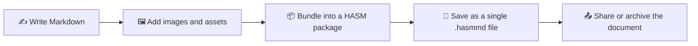

# HASM Markdown 🌟

HASM Markdown is a desktop-friendly markdown editor designed around one core idea: keep your document and everything it needs in one portable package. Unlike a normal markdown editor, this project aims to bundle the markdown content, referenced assets such as images, and future metadata into a single self-contained `.hasmmd` archive.

## Why this project exists ✨

Most markdown editors focus on writing and previewing text. HASM Markdown goes one step further by thinking about document portability and packaging.

- 📝 Write markdown in a simple editor
- 👁️ Preview the rendered result side by side
- 🖼️ Keep images and assets together with the document
- 📦 Package everything into a single `.hasmmd` file
- 🔧 Prepare for metadata-driven document control in future releases

## Current status 🚧

The current version already includes the basic editing experience:

- ✅ Markdown editor and preview pane
- ✅ Local package creation and save/open flow
- ✅ Tauri-based desktop application foundation
- 🚧 Advanced packaging and metadata features are planned

## How it works 🔄



## Feature overview 🧩

| Area | Status | Description |
|---|---|---|
| Editor | ✅ | Rich markdown editing experience |
| Preview | ✅ | Live rendered preview |
| Local package handling | ✅ | Save and open package content locally |
| Portable document packaging | 🚧 | Bundle assets and document into one archive |
| Metadata control | 🚧 | Planned support for document metadata management |

## Tech stack 🛠️

- Frontend: React + Bootstrap + Vite
- Desktop shell: Tauri
- Backend logic: Rust
- Packaging format: ZIP-based `.hasmmd` archive

## Getting started ▶️

For a detailed guide on setting up the Tauri development environment, see the following article:

- 📝 Qiita: https://qiita.com/Hibs/items/f430c84ad93152ecf094

Install dependencies:

```bash
npm install
```

Run the app in development mode:

```bash
npm run tauri dev
```

Build for production:

```bash
npm run build
npm run tauri build
```

## Project structure 📁

```text
src/                # React frontend UI and editor components
src-tauri/          # Tauri and Rust backend logic
public/             # Static assets
package.json        # Frontend scripts and dependencies
vite.config.js      # Vite configuration
```

## Roadmap 🗺️

Planned enhancements include:

- 🧠 Metadata editing and management
- 📦 Smarter bundling of markdown, images, and files
- 🧾 Better package validation and integrity checks
- 🌐 Improved sharing and portability experience

## Vision 🌈

The long-term goal is to make HASM Markdown a practical tool for creating documents that remain complete, portable, and easy to share even when they contain rich media and structured metadata.

## License 📜

This project is currently being shared without a formal license declaration.
If you intend to publish or reuse it publicly, please add an appropriate open-source license such as MIT, Apache-2.0, or BSD-2-Clause.
