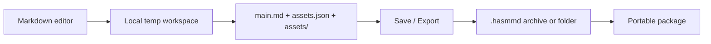

# HASM Markdown 🌟

A desktop markdown editor built around a simple idea: keep the document, its media, and its save flow in one portable package.

## 🧭 Architecture at a glance



| Layer | Purpose | Notes |
|---|---|---|
| Temp workspace | Live editing | Fast local save and asset mapping |
| Package target | Final storage | `.hasmmd` archive or regular folder |
| CLI | Validation and preview | `verify`, `preview`, `open` |

## ✅ Current status

Progress verified from the repository history on **2026-08-14**:

| Area | Status |
|---|---|
| Editor editing and revision behavior | ✅ |
| Markdown preview and missing-asset warnings | ✅ |
| Asset registration, aliases, and soft deletion | ✅ |
| Archive and folder open/save/export flow | ✅ |
| Workspace locking and close/reopen lifecycle | ✅ |
| Automated sequence and normal-workflow evaluations | ✅ |
| Advanced metadata and broader packaging | 🚧 |

The current automated coverage validates the storage/state workflow and focused
sequence checks. Native GUI acceptance still requires running the packaged Tauri
application.

## 🧩 Project structure

```text
hasm_markdown/
├── src/                  # React UI and editor experience
├── src-tauri/            # Tauri + Rust backend and CLI logic
├── docs/                 # architecture, requirements, evaluation docs
├── public/               # static assets
├── scripts/              # smoke/build checks
├── package.json          # frontend scripts and dependencies
├── vite.config.js        # Vite config
├── LICENSE               # GPL v3+
├── index.html            # app entry
└── README.md             # project overview
```

## 🗺️ Roadmap

| Phase | Focus |
|---|---|
| Now | editor, preview, asset diagnostics, and workspace lifecycle |
| Next | native GUI acceptance and continued save/export hardening |
| Later | metadata controls, richer packaging, sharing experience |

## 🛠️ Tech stack

[](https://react.dev/)
[](https://tauri.app/)
[](https://www.rust-lang.org/)
[](https://vitejs.dev/)
[](https://getbootstrap.com/)
[](https://daringfireball.net/projects/markdown/)

## 📚 Docs

- [System overview](docs/arch/01-system-overview.md)
- [Package structure](docs/arch/00-hasm_markdown-structure.md)
- [Directory structure](docs/arch/02-directory-structure.md)
- [CLI interface](docs/00-cli-interface.md)

## ▶️ Quick start

```bash
npm install
npm run tauri dev
```

For production build:

```bash
npm run build
npm run tauri build
```

## 📜 License

This project is licensed under the GNU General Public License v3.0 or later. See [LICENSE](LICENSE).
