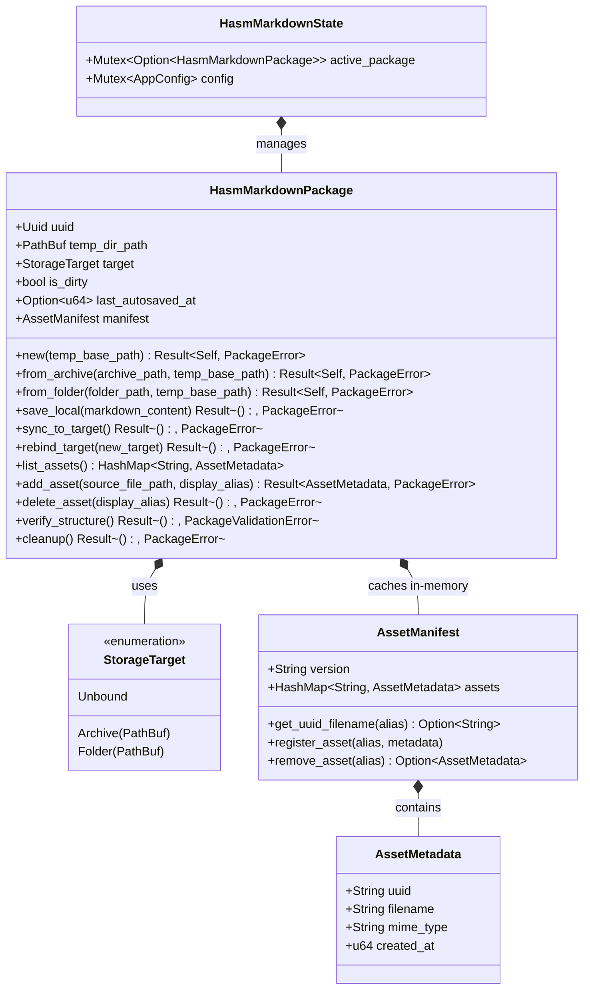

# HASM Markdown Package & Storage Structure

---

## 1. Physical Storage Layout

```text
<AppLocalDataDir>/<UUID>/
├── .lock                   # Exclusive edit process lock file
├── main.md                 # Primary Markdown content document
├── assets.json             # Asset alias-to-UUID metadata mapping file
└── assets/                 # Physical media files named using UUIDs
    ├── 3f8b9a20-1c2d-4e5f-8a9b-0c1d2e3f4a5b.png
    └── 9e8d7c6b-5a4f-3e2d-1c0b-a9b8c7d6e5f4.jpg

```

---

## 2. In-Memory Rust Domain Model & Class Design

### 2.1 Domain Class Diagram



---

### 2.2 Data Structure & Struct Implementation

```rust
use std::collections::HashMap;
use std::path::{Path, PathBuf};
use serde::{Deserialize, Serialize};
use uuid::Uuid;

// ===================================================================
// Asset Metadata & Manifest (In-Memory Cache)
// ===================================================================

/// Individual metadata entry for an asset file.
#[derive(Debug, Clone, Serialize, Deserialize)]
pub struct AssetMetadata {
    /// UUID identifier of the asset file
    pub uuid: String,
    /// Physical filename inside assets/ directory (e.g. "3f8b9a20-1c2d-4e5f.png")
    pub filename: String,
    /// MIME type of the asset
    pub mime_type: String,
    /// Unix timestamp in milliseconds when registered
    pub created_at: u64,
}

/// In-memory representation of assets.json for O(1) lookup speed.
#[derive(Debug, Clone, Default, Serialize, Deserialize)]
pub struct AssetManifest {
    pub version: String,
    /// Key: Display alias (e.g., "diagram.png"), Value: AssetMetadata
    pub assets: HashMap<String, AssetMetadata>,
}

impl AssetManifest {
    pub fn new() -> Self {
        Self {
            version: "1.0".to_string(),
            assets: HashMap::new(),
        }
    }

    /// O(1) fast lookup for resolving human-readable aliases to physical UUID filenames.
    pub fn get_uuid_filename(&self, alias: &str) -> Option<&str> {
        self.assets.get(alias).map(|m| m.filename.as_str())
    }

    pub fn register_asset(&mut self, alias: String, metadata: AssetMetadata) {
        self.assets.insert(alias, metadata);
    }

    pub fn remove_asset(&mut self, alias: &str) -> Option<AssetMetadata> {
        self.assets.remove(alias)
    }
}

// ===================================================================
// Storage Target Classification
// ===================================================================

#[derive(Debug, Clone, PartialEq, Eq, Serialize, Deserialize)]
pub enum StorageTarget {
    Archive(PathBuf),
    Folder(PathBuf),
    Unbound,
}

// ===================================================================
// Domain Error Definitions
// ===================================================================

#[derive(Debug, Clone, Serialize, Deserialize)]
pub enum PackageValidationError {
    MissingMainMarkdown { path: PathBuf },
    MissingAssetsJson { path: PathBuf },
    InvalidAssetDirectory { path: PathBuf },
    WorkspaceLocked { holder_pid: u32 },
}

#[derive(Debug, Clone, Serialize, Deserialize)]
pub enum PackageError {
    IoError { message: String },
    ZipError { message: String },
    ValidationError(PackageValidationError),
    NoActiveTarget,
    AssetNotFound { alias: String },
}

// ===================================================================
// Core Domain Entity: HasmMarkdownPackage
// ===================================================================

#[derive(Debug, Clone, Serialize, Deserialize)]
pub struct HasmMarkdownPackage {
    pub uuid: Uuid,
    pub temp_dir_path: PathBuf,
    pub target: StorageTarget,
    pub is_dirty: bool,
    pub last_autosaved_at: Option<u64>,
    /// In-memory cached asset manifest to prevent repetitive JSON disk reads
    pub manifest: AssetManifest,
}

impl HasmMarkdownPackage {
    /// Scaffold a new unbound workspace in App Local memory.
    pub fn new(temp_base_path: &Path) -> Result<Self, PackageError> {
        let uuid = Uuid::new_v4();
        let temp_dir_path = temp_base_path.join(uuid.to_string());
        
        std::fs::create_dir_all(temp_dir_path.join("assets"))
            .map_err(|e| PackageError::IoError { message: e.to_string() })?;
            
        std::fs::write(temp_dir_path.join("main.md"), "# Welcome to HASM Markdown\n")
            .map_err(|e| PackageError::IoError { message: e.to_string() })?;

        let manifest = AssetManifest::new();
        let manifest_json = serde_json::to_string_pretty(&manifest)
            .map_err(|e| PackageError::IoError { message: e.to_string() })?;
            
        std::fs::write(temp_dir_path.join("assets.json"), manifest_json)
            .map_err(|e| PackageError::IoError { message: e.to_string() })?;

        Ok(Self {
            uuid,
            temp_dir_path,
            target: StorageTarget::Unbound,
            is_dirty: false,
            last_autosaved_at: None,
            manifest,
        })
    }

    /// Loads and parses assets.json into the in-memory cache upon workspace initialization.
    pub fn load_manifest(&mut self) -> Result<(), PackageError> {
        let json_path = self.temp_dir_path.join("assets.json");
        if json_path.exists() {
            let content = std::fs::read_to_string(&json_path)
                .map_err(|e| PackageError::IoError { message: e.to_string() })?;
            self.manifest = serde_json::from_str(&content)
                .map_err(|e| PackageError::IoError { message: e.to_string() })?;
        } else {
            self.manifest = AssetManifest::new();
        }
        Ok(())
    }

    /// Flushes markdown content and writes updated assets.json to App Local disk.
    pub fn save_local(&mut self, markdown_content: &str) -> Result<(), PackageError> {
        let main_md_path = self.temp_dir_path.join("main.md");
        std::fs::write(main_md_path, markdown_content)
            .map_err(|e| PackageError::IoError { message: e.to_string() })?;
            
        // Flush in-memory manifest to assets.json
        let manifest_json = serde_json::to_string_pretty(&self.manifest)
            .map_err(|e| PackageError::IoError { message: e.to_string() })?;
        std::fs::write(self.temp_dir_path.join("assets.json"), manifest_json)
            .map_err(|e| PackageError::IoError { message: e.to_string() })?;

        self.is_dirty = false;
        self.last_autosaved_at = Some(
            std::time::SystemTime::now()
                .duration_since(std::time::UNIX_EPOCH)
                .unwrap()
                .as_millis() as u64
        );
        Ok(())
    }

    /// Adds a new asset: copies to physical UUID filename and updates in-memory manifest cache.
    pub fn add_asset(&mut self, source_path: &Path, display_alias: String) -> Result<AssetMetadata, PackageError> {
        let asset_uuid = Uuid::new_v4().to_string();
        let extension = source_path.extension().and_then(|e| e.to_str()).unwrap_or("bin");
        let physical_filename = format!("{}.{}", asset_uuid, extension);
        let dest_path = self.temp_dir_path.join("assets").join(&physical_filename);

        std::fs::copy(source_path, &dest_path)
            .map_err(|e| PackageError::IoError { message: e.to_string() })?;

        let metadata = AssetMetadata {
            uuid: asset_uuid,
            filename: physical_filename,
            mime_type: format!("image/{}", extension),
            created_at: std::time::SystemTime::now()
                .duration_since(std::time::UNIX_EPOCH)
                .unwrap()
                .as_millis() as u64,
        };

        // Update in-memory manifest cache immediately
        self.manifest.register_asset(display_alias, metadata.clone());
        self.is_dirty = true;

        Ok(metadata)
    }

    /// Deletes an asset: removes physical UUID file and purges entry from in-memory manifest cache.
    pub fn delete_asset(&mut self, display_alias: &str) -> Result<(), PackageError> {
        if let Some(metadata) = self.manifest.remove_asset(display_alias) {
            let file_path = self.temp_dir_path.join("assets").join(&metadata.filename);
            if file_path.exists() {
                std::fs::remove_file(file_path)
                    .map_err(|e| PackageError::IoError { message: e.to_string() })?;
            }
            self.is_dirty = true;
            Ok(())
        } else {
            Err(PackageError::AssetNotFound { alias: display_alias.to_string() })
        }
    }

    /// Structural integrity check.
    pub fn verify_structure(&self) -> Result<(), PackageValidationError> {
        let main_md_path = self.temp_dir_path.join("main.md");
        if !main_md_path.exists() {
            return Err(PackageValidationError::MissingMainMarkdown { path: main_md_path });
        }
        
        let assets_json_path = self.temp_dir_path.join("assets.json");
        if !assets_json_path.exists() {
            return Err(PackageValidationError::MissingAssetsJson { path: assets_json_path });
        }

        let assets_dir_path = self.temp_dir_path.join("assets");
        if !assets_dir_path.is_dir() {
            return Err(PackageValidationError::InvalidAssetDirectory { path: assets_dir_path });
        }
        
        Ok(())
    }
}

```