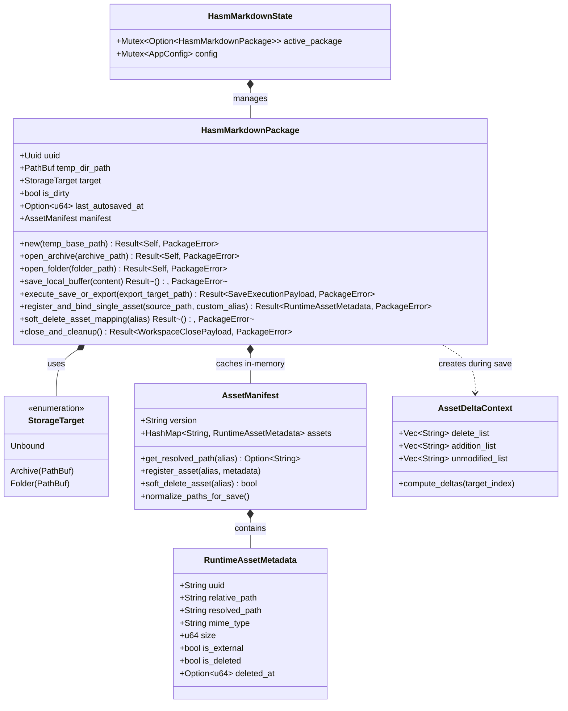

# HASM Markdown Package & Storage Structure

---

## 1. Physical Storage Layout

```text
<AppLocalDataDir>/<UUID>/
├── .lock                   # JSON process lock file (PID, status, timestamp)
├── main.md                 # Primary Markdown content document
├── assets.json             # Asset metadata mapping (alias, UUID, resolvedPath, isDeleted flag)
└── assets/                 # Physical media files named using UUIDs (or external target)
    ├── 3f8b9a20-1c2d-4e5f-8a9b-0c1d2e3f4a5b.png
    └── 9e8d7c6b-5a4f-3e2d-1c0b-a9b8c7d6e5f4.jpg

```

### 1.1 Lock File JSON Payload Specification (`.lock`)

```json
{
  "pid": 1024,
  "status": "Locked",
  "workspaceUuid": "3f8b9a20-1c2d-4e5f-a678-9b0c1d2e3f4a",
  "lastAcquiredAt": 1786533400000,
  "lastReleasedAt": null
}

```

---

## 2. In-Memory Rust Domain Model & Class Design

### 2.1 Domain Class Diagram



---

### 2.2 Data Structure & Struct Implementation

```rust
use std::collections::HashMap;
use std::path::{Path, PathBuf};
use serde::{Deserialize, Serialize};
use uuid::Uuid;

// ===================================================================
// Process Lock Payload Structure (.lock)
// ===================================================================

#[derive(Debug, Clone, Serialize, Deserialize)]
pub struct ProcessLockPayload {
    pub pid: u32,
    pub status: String, // "Locked" | "Unlocked"
    pub workspace_uuid: String,
    pub last_acquired_at: u64,
    pub last_released_at: Option<u64>,
}

// ===================================================================
// Runtime Asset Metadata & Manifest
// ===================================================================

/// Individual metadata entry for an asset file with soft-delete support.
#[derive(Debug, Clone, Serialize, Deserialize)]
pub struct RuntimeAssetMetadata {
    pub uuid: String,
    /// Portable package-relative path (e.g. "assets/3f8b9a20.png")
    pub relative_path: String,
    /// Runtime absolute path or asset-stream:// URI
    pub resolved_path: String,
    pub mime_type: String,
    pub size: u64,
    pub is_external: bool,
    /// Soft deletion flag (true = marked for deletion on next save)
    pub is_deleted: bool,
    pub deleted_at: Option<u64>,
}

/// In-memory asset manifest cache.
#[derive(Debug, Clone, Default, Serialize, Deserialize)]
pub struct AssetManifest {
    pub version: String,
    /// Key: Custom Display Alias, Value: RuntimeAssetMetadata
    pub assets: HashMap<String, RuntimeAssetMetadata>,
}

impl AssetManifest {
    pub fn new() -> Self {
        Self {
            version: "1.0".to_string(),
            assets: HashMap::new(),
        }
    }

    /// Resolves an alias string to an active runtime absolute path or stream URI.
    pub fn get_resolved_path(&self, alias: &str) -> Option<&str> {
        self.assets.get(alias).and_then(|m| {
            if m.is_deleted { None } else { Some(m.resolved_path.as_str()) }
        })
    }

    pub fn register_asset(&mut self, alias: String, metadata: RuntimeAssetMetadata) {
        self.assets.insert(alias, metadata);
    }

    /// Marks an asset as soft-deleted without purging its metadata or key.
    pub fn soft_delete_asset(&mut self, alias: &str) -> bool {
        if let Some(metadata) = self.assets.get_mut(alias) {
            metadata.is_deleted = true;
            metadata.deleted_at = Some(
                std::time::SystemTime::now()
                    .duration_since(std::time::UNIX_EPOCH)
                    .unwrap_or_default()
                    .as_millis() as u64,
            );
            true
        } else {
            false
        }
    }
}

// ===================================================================
// Storage Target & Delta Operational Context
// ===================================================================

#[derive(Debug, Clone, PartialEq, Eq, Serialize, Deserialize)]
pub enum StorageTarget {
    Archive(PathBuf),
    Folder(PathBuf),
    Unbound,
}

#[derive(Debug, Clone, Default)]
pub struct AssetDeltaContext {
    pub delete_list: Vec<String>,
    pub addition_list: Vec<String>,
    pub unmodified_list: Vec<String>,
}

// ===================================================================
// Domain Error Definitions
// ===================================================================

#[derive(Debug, Clone, Serialize, Deserialize)]
pub enum PackageValidationError {
    MissingMainMarkdown { path: PathBuf },
    MissingAssetsJson { path: PathBuf },
    InvalidAssetDirectory { path: PathBuf },
    WorkspaceLocked { holder_pid: u32 },
}

#[derive(Debug, Clone, Serialize, Deserialize)]
pub enum PackageError {
    IoError { message: String },
    ZipError { message: String },
    AliasCollision { alias: String },
    ValidationError(PackageValidationError),
    NoActiveTarget,
    AssetNotFound { alias: String },
}

// ===================================================================
// Core Domain Entity: HasmMarkdownPackage
// ===================================================================

#[derive(Debug, Clone, Serialize, Deserialize)]
pub struct HasmMarkdownPackage {
    pub uuid: Uuid,
    pub temp_dir_path: PathBuf,
    pub target: StorageTarget,
    pub is_dirty: bool,
    pub last_autosaved_at: Option<u64>,
    pub manifest: AssetManifest,
}

impl HasmMarkdownPackage {
    /// Fast 10-second periodic local autosave (App Local UTF-8 text write only).
    pub fn save_local_buffer(&mut self, markdown_content: &str) -> Result<(), PackageError> {
        let main_md_path = self.temp_dir_path.join("main.md");
        let tmp_path = self.temp_dir_path.join("main.md.tmp");

        std::fs::write(&tmp_path, markdown_content)
            .map_err(|e| PackageError::IoError { message: e.to_string() })?;
        std::fs::rename(tmp_path, main_md_path)
            .map_err(|e| PackageError::IoError { message: e.to_string() })?;

        self.is_dirty = false;
        self.last_autosaved_at = Some(
            std::time::SystemTime::now()
                .duration_since(std::time::UNIX_EPOCH)
                .unwrap_or_default()
                .as_millis() as u64,
        );
        Ok(())
    }

    /// Registers a single asset via absolute path binding without heavy archive copies.
    pub fn register_and_bind_single_asset(
        &mut self,
        source_path: &Path,
        custom_alias: String,
    ) -> Result<RuntimeAssetMetadata, PackageError> {
        if self.manifest.assets.contains_key(&custom_alias) {
            return Err(PackageError::AliasCollision { alias: custom_alias });
        }

        let asset_uuid = Uuid::new_v4().to_string();
        let extension = source_path.extension().and_then(|e| e.to_str()).unwrap_or("bin");
        let relative_path = format!("assets/{}.{}", asset_uuid, extension);
        let resolved_path = source_path.to_string_lossy().to_string();

        let metadata = RuntimeAssetMetadata {
            uuid: asset_uuid,
            relative_path,
            resolved_path,
            mime_type: format!("image/{}", extension),
            size: std::fs::metadata(source_path).map(|m| m.len()).unwrap_or(0),
            is_external: true,
            is_deleted: false,
            deleted_at: None,
        };

        self.manifest.register_asset(custom_alias, metadata.clone());
        self.is_dirty = true;
        Ok(metadata)
    }

    /// Executes soft deletion by setting is_deleted = true.
    pub fn soft_delete_asset_mapping(&mut self, alias: &str) -> Result<(), PackageError> {
        if self.manifest.soft_delete_asset(alias) {
            self.is_dirty = true;
            Ok(())
        } else {
            Err(PackageError::AssetNotFound { alias: alias.to_string() })
        }
    }
}