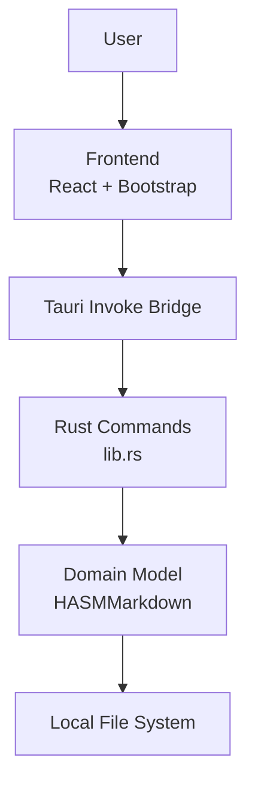

# System Components

This document explains the main building blocks of HASM Markdown and how they are connected.

## Layered architecture

## Frontend components

- `App` in `src/main.jsx` keeps shared state: markdown and current package.
- `Menu` in `src/Menu.jsx` provides file actions: Open and Save As.
- `HASM_Markdown_Editor` in `src/HASM_Markdown_Editor.jsx` provides editor + preview and periodic auto-save.

## Rust backend responsibilities

- `src-tauri/src/lib.rs` registers Tauri commands and owns shared app state with a mutex.
- `src-tauri/src/hasm_markdown.rs` contains package logic:
  - Create package scaffold.
  - Read/extract from `.hasmmd` archive.
  - Save markdown to local package.
  - Zip local package to `.hasmmd`.

## Storage model

- Temporal layer: a package is edited in a local UUID folder under `appLocalDataDir`.
- Archive layer: `.hasmmd` files are selected from or saved to user-facing locations (defaulting to `documentDir` in dialog).
- Markdown content is stored as `main.md`.
- Package assets are stored in `assets/`.
- Portable export format is ZIP-based `.hasmmd`.
