# HASM Markdown Desktop Application - High Level Design Document

This document defines the high-level architecture, dual-layer storage strategy, asset mapping metadata management (`assets.json`), CLI interface specifications (`verify`, `preview`, `open`), external editor synchronization policy, single-workspace process locking (`.lock`), asset delta packing, React application state management, routing guard protection mechanisms, global notifications, save status indicators, color theme management, and complete end-to-end screen/operation flowcharts for the HASM Markdown Editor (`hasm_markdown.exe`).

---

## 1. System Overview & CLI Interface Strategy

HASM Markdown provides both a rich **GUI Desktop Interface** (powered by Tauri v2 + React) and a robust **CLI Interface** designed for automated verification, local preview compatibility, and CLI pipeline integration.

### 1.1 Dual-Layer Storage Strategy

1. **Temporal Layer (App Local Temporary Workspace):**
* **Location:** `<AppLocalDataDir>/<UUID>/`

* **Contents:** `main.md`, `assets.json` (Alias-to-UUID metadata mapping), `.lock` (JSON process lock tracking file), and the `assets/` directory (UUID-named physical media files).


* **Behavior:** All editing actions, single-asset registrations, soft-deletions (`isDeleted: true`), and fast 10-second periodic local autosaves operate exclusively within this sandbox to ensure zero UI latency. `Ctrl+S` shortcuts are completely unbound.


2. **Archive / External Layer (Master Storage Target):**
* **Location:** User-specified filesystem path (`.hasmmd` ZIP archive or External Folder).


* **Purpose:** Long-term persistence and portable sharing.


* **Behavior:** Synchronized exclusively upon explicit user actions ("Save" or "Export As") via a performance-optimized **Asset Delta Synchronization Algorithm** (computing deletion and addition lists without full archive re-compression).


3. **Asset Alias & Dynamic Path Resolution Policy (`assets.json` & `resolvedPath`):**
* Authors write intuitive media file tags in Markdown (e.g., ``).
* Portable relative paths (`assets/<uuid>.<ext>`) stored in `assets.json` are dynamically expanded at runtime into absolute `resolvedPath` URIs (`asset-stream://` URIs for Mode A ZIP archives or OS absolute file paths for Mode B folders).


* Soft-deleted assets (`isDeleted: true`) or missing files are dynamically wrapped in `<span class="missing-asset-warning">` preview spans and rendered with red line warning decorators in the editor.


4. **Single-Workspace Process Locking (`.lock`):**
* Multi-instance window execution across the OS is permitted, but each workspace directory is restricted to a single active window.


* On unmount/close, the physical `.lock` file is preserved, and its internal payload is set atomically to `pid: 0` and `status: "Unlocked"`.


---

### 1.2 CLI Execution Modes

1. **Structural Verification Mode (`hasm_markdown verify <PATH>`):**
* Non-GUI execution mode for `.hasmmd` archives or folder workspaces.
* Inspects structural integrity (`main.md`, `assets.json`, `assets/` structure).


* Outputs diagnostic errors (`missingAssets`) and warnings (orphans) to `stdout` or formatted JSON, returning exit code `0` (Valid) or `1` (Invalid).


2. **Absolute Path Local Preview Mode (`hasm_markdown preview <FOLDER_PATH>`):**
* **Folder Type Only Mode:** Restricted strictly to directory workspaces (Mode B).
* Reads `main.md` and `assets.json` from the specified target directory.
* Resolves all relative asset links (e.g. ``) into **OS absolute file paths** based on `assets.json` mappings and outputs the converted Markdown content to `stdout` (or stdout-piped stream).
* **Value:** Enables seamless local preview rendering across external editors (e.g. VS Code, Obsidian, CLI renderers) regardless of where the output is saved or piped on the local file system.


3. **Interactive Workspace Mode (`hasm_markdown open <PATH>` or `hasm_markdown <PATH>`):**
* Standard GUI launcher mode. Mounts target path via `SEQ-MD-01`, validates process locks, resolves `resolvedPath` URIs, and routes directly to `/editor`.


---

## 2. React Global State Management, Routing Guard & Cross-Cutting UI Services

### 2.1 Central React Application State (`usePackageStore`)

```typescript
export interface PackageStoreState {
  // Active Workspace Identity & Status
  uuid: string | null;                  // Temporary workspace UUID (null if unmounted)
  tempDirPath: string | null;           // Absolute path to App Local sandbox
  targetType: 'Archive' | 'Folder' | 'Unbound' | null; // Storage target classification
  targetPath: string | null;            // Master target path on disk (.hasmmd path or folder path)
  
  // Loading & Mount Flags
  isLoaded: boolean;                    // Set to TRUE only after successful IPC load & path resolution
  isLoading: boolean;                   // Active IPC loading/unzipping spinner indicator
  
  // Document Buffer & Diff Tracking
  rawContent: string;                   // Active live Markdown text buffer in editor
  lastSavedContent: string;             // Text buffer at last successful save/autosave
  isDirty: boolean;                     // Computed as (rawContent !== lastSavedContent)
  isSaving: boolean;                    // Prevents concurrent autosave/save IPC calls
  
  // Metadata & Warnings
  manifest: RuntimeAssetManifest | null;// Active manifest populated with absolute resolvedPaths
  missingAssets: MissingAssetInfo[];    // List of referenced asset tags missing physical files
  warnings: PackageWarning[];           // List of unregistered orphan files in workspace
  
  // Global UI State
  themeMode: 'Light' | 'Dark' | 'High-Contrast'; // Active 3-color palette theme
}

```

---

### 2.2 Navigation Guard Mechanism (`<WorkspaceGuard>`)

To prevent illegal states, corrupted rendering, or application crashes caused by unexpected user operations (e.g., direct URL navigation to `/editor` before loading a workspace, refreshing the page mid-session, or manipulating route history), all protected routes (`/editor`, `/assets`, `/loading-model`) are wrapped inside a strict **Routing Guard Component (`<WorkspaceGuard>`)**.

* **Unloaded State Access Denial:** If a user attempts to access `/editor` or `/assets` while `isLoaded === false` or `uuid === null`, the Routing Guard immediately intercepts the navigation request, cancels component rendering, and redirects the user to the selection page (`/select`) with a warning toast notification ("No active workspace loaded. Please select or create a package.").
* **System Error Boundary Redirection:** If workspace initialization fails during startup or re-verification, the guard routes the application to the appropriate error page (`/error-model` for structural integrity errors or `/error-app` for runtime/environment failures).
* **Unsaved Exit Guard:** Intercepts route transitions when `isDirty === true` and prompts the Unsaved Changes Modal.

---

### 2.3 Cross-Cutting Global UI Services (Global Menu, Readout & Themes)

* **Global Diagnostic Menu:** A persistent drawer/modal rendering real-time **Error List** (missing asset tags, lock conflicts) and **Warning List** (orphan assets, soft-deleted references) with badge counters.
* **Real-time Save State Readout:** A unified header status displaying live state transitions ("Unsaved Changes (*)", "Saving...", "Autosaved Locally at HH:mm:ss", and "Master Target Synced").
* **App-Wide 3-Color Theme Selector:** Supports dynamic switching between **`Light`**, **`Dark`**, and **`High-Contrast`** palettes across all routes without page reloads, persisting preference in `localStorage` and backend `AppConfig`.

---

## 3. High-Level Flowchart (System Lifecycle, CLI, Guard & Operations)

```mermaid
%%{
  init: {
    'theme': 'base',
    'themeVariables': {
      'fontFamily': 'inter, -apple-system, BlinkMacSystemFont, "Segoe UI", Roboto, sans-serif',
      'fontSize': '14px',
      'primaryColor': '#1e293b',
      'primaryTextColor': '#f8fafc',
      'primaryBorderColor': '#475569',
      'lineColor': '#64748b',
      'secondaryColor': '#334155',
      'tertiaryColor': '#0f172a',
      'clusterBkg': '#0f172a',
      'clusterBorder': '#334155',
      'edgeLabelBackground': '#1e293b'
    }
  }
}%%
flowchart
    %% Node Style Definitions
    classDef page fill:#1e40af,stroke:#60a5fa,stroke-width:1.5px,color:#ffffff;
    classDef modal fill:#334155,stroke:#94a3b8,stroke-width:1.5px,color:#ffffff;
    classDef error fill:#991b1b,stroke:#f87171,stroke-width:1.5px,color:#ffffff;
    classDef action fill:#065f46,stroke:#34d399,stroke-width:1.5px,color:#ffffff;
    classDef tauri fill:#581c87,stroke:#c084fc,stroke-width:1.5px,color:#ffffff;
    classDef cond fill:#854d0e,stroke:#facc15,stroke-width:1.5px,color:#ffffff;
    classDef guard fill:#0369a1,stroke:#38bdf8,stroke-width:2px,color:#ffffff;
    classDef cli fill:#0369a1,stroke:#38bdf8,stroke-width:2px,color:#ffffff;

    %% ----------------------------------------------------
    %% 0. CLI Command Dispatcher Phase
    %% ----------------------------------------------------
    subgraph CLIPhase["0. CLI Interface Entry Point"]
        CLICall(["Invoke CLI Command"]):::cli --> ParseCLI{"Parse Subcommand & Arguments"}:::cond
        
        ParseCLI -->|verify <PATH>| ExecVerify[["CLI: Inspect Package Structure & Assets"]]:::cli
        ParseCLI -->|preview <FOLDER_PATH>| CheckFolderMode{"Target Is Directory (Folder Type)?"}:::cond
        ParseCLI -->|open <PATH> or <PATH>| LaunchGUI(["Launch Desktop Application Window"]):::action
        ParseCLI -->|No Arguments| LaunchGUI
        
        %% Verify Branch
        ExecVerify --> CheckValid{"Validation Passed?"}:::cond
        CheckValid -->|Yes| OutputSuccess["Output Valid Result (JSON/Text) & Exit Code 0"]:::action
        CheckValid -->|No| OutputError["Output Missing Assets / Errors & Exit Code 1"]:::action
        
        %% Preview Branch (Folder Type Only)
        CheckFolderMode -->|No - ZIP Archive| RejectPreview["Output Error: Preview subcommand supports Folder Type only & Exit Code 1"]:::action
        CheckFolderMode -->|Yes - Folder Directory| ReadMetadata[["CLI: Read main.md and assets.json from Target Folder"]]:::cli
        ReadMetadata --> ExpandAbsolutePaths[["CLI: Resolve asset:alias links to OS Absolute Paths"]]:::cli
        ExpandAbsolutePaths --> OutputPreviewMarkdown["Output Converted Markdown Stream to stdout / Terminal"]:::action
    end

    %% ----------------------------------------------------
    %% 1. App Boot, Guard Check & Workspace Loading Phase
    %% ----------------------------------------------------
    subgraph BootPhase["1. App Launch, Routing Guard & Workspace Loading Phase"]
        LaunchGUI --> ValidateHASMApp[["Backend: Validate Runtime Environment"]]:::tauri
        ValidateHASMApp --> AppCheck{"Runtime Valid?"}:::cond
        
        AppCheck -->|No| ErrorHASMApp[/"System Error Screen /error-app"/]:::error
        AppCheck -->|Yes| DataSelectIF{"Target Path Provided?"}:::cond
        
        DataSelectIF -->|No| SelectPage["File Selection Screen /select"]:::page
        DataSelectIF -->|Yes| AutoInspectType{"Inspect Target Storage Type"}:::cond
        
        AutoInspectType -->|ZIP File| LockCheckZip[["Backend: Check .lock File PID & Handles"]]:::tauri
        AutoInspectType -->|Existing Folder| LockCheckFolder[["Backend: Check .lock File PID & Handles"]]:::tauri
        
        LockCheckZip --> IsLockedZip{"Workspace Locked?"}:::cond
        IsLockedZip -->|Yes| LockModal["Display Lock Conflict Modal"]:::modal
        IsLockedZip -->|No| UnzipMetadata[["Backend: Extract main.md & assets.json ONLY"]]:::tauri
        
        LockCheckFolder --> IsLockedFolder{"Workspace Locked?"}:::cond
        IsLockedFolder -->|Yes| LockModal
        IsLockedFolder -->|No| MountFolder[["Backend: Read Metadata & Acquire Master Handle"]]:::tauri
        
        UnzipMetadata --> ResolvePaths[["Backend: Expand relativePath to runtime resolvedPath"]]:::tauri
        MountFolder --> ResolvePaths
        
        ResolvePaths --> CommitState["Commit Payload to usePackageStore & Set isLoaded = true"]:::action
        CommitState --> EditorPage["Markdown Editor Screen /editor"]:::page
    end

    %% ----------------------------------------------------
    %% Routing Guard Interception Flow (Unexpected Operations)
    %% ----------------------------------------------------
    subgraph GuardFlow["Routing Guard Interception Mechanism"]
        DirectNav(["User Attempts Direct Access to /editor or /assets"]):::action --> GuardCheck{"<WorkspaceGuard>: Check isLoaded & uuid"}:::guard
        GuardCheck -->|isLoaded == true & uuid != null| AllowRoute(["Allow Route Access"]):::action
        GuardCheck -->|isLoaded == false OR uuid == null| DenyRoute(["Intercept Route Transition"]):::guard
        DenyRoute --> ToastWarning["Display Warning Toast: No Active Workspace Loaded"]:::action
        ToastWarning --> RedirectSelect["Redirect Immediately to /select"]:::page
    end
        
    %% ----------------------------------------------------
    %% 2. Text Editing & Fast Local Autosave
    %% ----------------------------------------------------
    subgraph AutosaveFlow["2 Text Editing, Red-Text Highlight & Fast Local Autosave Loop"]
        EditorPage -->|Type Text| TextChange(["Edit Document Buffer"]):::action
        TextChange --> SetDirty["Set isDirty = true"]:::action
        
        TextChange --> RenderPreview(["markdown-it Render & Red-Text Evaluation"]):::action
        RenderPreview --> DisplayPreview(["Update Editor & Preview Pane & Save Readout"]):::action
        
        SetDirty --> AutosaveTimer{"10s Timer Elapsed?"}:::cond
        AutosaveTimer -->|No| WaitEdit(["Continue Editing"]):::action
        WaitEdit --> AutosaveTimer
        
        AutosaveTimer -->|Yes| CheckDirty{"isDirty == true?"}:::cond
        CheckDirty -->|No| AutosaveTimer
        CheckDirty -->|Yes| SaveLocalPkg[["Backend: Atomic Write main.md.tmp -> main.md in App Local"]]:::tauri
        SaveLocalPkg --> ResetDirty["Set isDirty = false & Update Saved Timestamp Readout"]:::action
        ResetDirty --> AutosaveTimer
    end

    %% ----------------------------------------------------
    %% 3. Single-Asset Upload & Soft-Delete Window
    %% ----------------------------------------------------
    subgraph AssetFlow["3 Single-Asset Management Sub-window"]
        EditorPage -->|Click Assets| OpenAssetManager(["Open Asset Window"]):::action
        OpenAssetManager --> FetchAssets[["Read Manifest & Filter isDeleted: true Entries"]]:::tauri
        FetchAssets --> AssetWindow["Asset Management Window"]:::modal
        
        AssetWindow --> AssetAction{"Action Type"}:::cond
        
        AssetAction -->|Add Asset - Single File| AliasModal["Alias Naming Modal"]:::modal
        AliasModal --> RegisterAsset[["Backend: Register resolvedPath & Bind Asset UUID"]]:::tauri
        RegisterAsset --> RefreshAssets[["Refresh Asset Store State"]]:::action
        
        AssetAction -->|Soft Delete Asset| ScanRef[["Scan main.md Text for References"]]:::tauri
        ScanRef --> DeleteConfirmModal["In-Use Warning / Confirmation Modal"]:::modal
        DeleteConfirmModal --> SoftDelete[["Backend: Set isDeleted = true & deletedAt timestamp"]]:::tauri
        SoftDelete --> RefreshAssets
        
        RefreshAssets --> AssetWindow
        AssetWindow -->|Close Window| RecalcMissing[["Recalculate missingAssets & Update Red Line Decorators"]]:::tauri
        RecalcMissing --> EditorPage
    end

    %% ----------------------------------------------------
    %% 4. Explicit Save & Asset Delta Packing
    %% ----------------------------------------------------
    subgraph SaveFlow["4 Explicit Save & Export - Asset Delta Synchronization"]
        EditorPage -->|Click Save or Export| SaveActionType{"Action Type"}:::cond
        
        SaveActionType -->|In-Place Save| ExecSave[["Backend: Compute delete_list & addition_list"]]:::tauri
        SaveActionType -->|Export As| SaveDialog["OS Save File Dialog"]:::modal
        SaveDialog --> ExecSave
        
        ExecSave --> PurgeSoftDeleted[["Purge delete_list binaries from target"]]:::tauri
        PurgeSoftDeleted --> PackAdditions[["Compress addition_list binaries to target"]]:::tauri
        PackAdditions --> NormalizeManifest[["Normalize assets.json to relative paths"]]:::tauri
        NormalizeManifest --> AtomicCommit[["Atomic Replace Target Archive / Folder"]]:::tauri
        AtomicCommit --> RebindLocal[["Sync App Local & Re-expand resolvedPaths"]]:::tauri
        RebindLocal --> SaveComplete["Display Success Toast & Readout: Master Target Synced"]:::action
        SaveComplete --> EditorPage
    end

    %% ----------------------------------------------------
    %% 5. Workspace Close & Process Lock Release
    %% ----------------------------------------------------
    subgraph CloseFlow["5 Workspace Close & Process Lock Release Phase"]
        EditorPage -->|Click Close or App Quit| CloseTrigger(["Trigger Close Workspace"]):::action
        CloseTrigger --> CheckUnsavedClose{"isDirty == true?"}:::cond
        
        CheckUnsavedClose -->|Yes| PromptCloseModal["Unsaved Changes Modal"]:::modal
        PromptCloseModal --> UserCloseChoice{"User Selection"}:::cond
        
        UserCloseChoice -->|Cancel| CancelClose(["Remain in Editor"]):::action
        CancelClose --> EditorPage
        
        UserCloseChoice -->|Save| ExecSave
        UserCloseChoice -->|Discard| ReleaseHandles
        
        CheckUnsavedClose -->|No| ReleaseHandles[["Backend: Close Master Target File Handles"]]:::tauri
        ReleaseHandles --> UpdateLock[["Backend: Update .lock Payload to PID: 0 / Unlocked"]]:::tauri
        UpdateLock --> CleanupCache[["Backend: Clean Up App Local Temp Caches"]]:::tauri
        CleanupCache --> RouteSelect["Reset Store (isLoaded = false) & Route to /select or Exit Window"]:::action
    end

    %% ----------------------------------------------------
    %% 6. Global Menu & Theme Selector Operations
    %% ----------------------------------------------------
    subgraph GlobalMenuFlow["6 Global Menu, Diagnostic Lists & Theme Switching"]
        AppLayout -->|Click Notification / Menu Icon| OpenMenu(["Open Global Menu Drawer"]):::action
        OpenMenu --> RenderMenu["Render Error List, Warning List & Readout Status"]:::modal
        
        RenderMenu --> MenuAction{"Menu Action"}:::cond
        MenuAction -->|Select Error Item| JumpLine["Close Drawer & Scroll Editor to Missing Asset Line"]:::action
        MenuAction -->|Change Theme| SwitchTheme["Apply Theme Palette (Light / Dark / High-Contrast)"]:::action
        
        SwitchTheme --> PersistTheme[["Backend: Save Preference to AppConfig & localStorage"]]:::tauri
        PersistTheme --> ApplyCSS["Update root data-theme attribute across all routes"]:::action
        
        JumpLine --> EditorPage
        ApplyCSS --> AppLayout
    end

```



---

## 4. Detailed Phase Summaries

1. **App Launch, Lock Check & Selective Import Phase:**
   * Checks `<UUID>/.lock` status; rejects access if another active PID holds the lock.
   * Extracts **only** `main.md` and `assets.json` into `App Local`. Media binaries remain in ZIP for on-demand streaming (`asset-stream://`).
   * Dynamically resolves portable relative paths to `resolvedPath` URIs and commits payload to `usePackageStore` setting `isLoaded = true`.

2. **Routing Guard Protection Mechanism (`<WorkspaceGuard>`):**
   * Intercepts all direct navigation attempts to `/editor` or `/assets`.
   * Validates `isLoaded === true` and `uuid !== null`. If unauthorized, redirects immediately to `/select`.

3. **Text Editing, Red-Text Highlight & Fast Local Autosave Loop:**
   * Tracks live edits (`isDirty = true`). `Ctrl+S` manual shortcuts are unbound.
   * `markdown-it` resolves asset tags to `resolvedPath` URIs and wraps missing/soft-deleted assets in red warning spans and line decorators.
   * 10-second timer periodically persists UTF-8 text to `<UUID>/main.md` in `App Local`.

4. **Single-Asset Management Sub-window:**
   * Enforces single-file drop/selection constraints and prompts Alias Naming Modal.
   * Soft-deletes assets (`isDeleted: true`) in `assets.json`.
   * Recalculates `missingAssets` upon window closure to update editor warning decorators.

5. **Explicit Save & Export (Asset Delta Synchronization):**
   * Computes `delete_list` (`isDeleted: true`) and `addition_list`.
   * Purges deleted binaries, packs new additions, normalizes paths to relative format (`assets/<uuid>.<ext>`), and performs atomic file replacement.
   * Updates readout status to "Master Target Synced".


6. **Workspace Close & Process Lock Release Phase:**
   * Intercepts close attempts if `isDirty === true`.
   * Releases master OS file handles.
   * Atomically updates `<UUID>/.lock` payload to `pid: 0` and `status: "Unlocked"`, resets store (`isLoaded = false`), and routes to `/select`.

7. **Global Menu Notifications, Save State Indicator & Theme Switching:**
   * Displays persistent Warning List and Error List notifications across all routes.
   * Updates real-time save state readouts in header ("Unsaved (*)", "Saving...", "Autosaved at HH:mm:ss", "Master Target Synced").
   * Provides 16ms instant theme switching across `Light`, `Dark`, and `High-Contrast` palettes, persisted in `localStorage` and `AppConfig`.


---

## 5. HASM Markdown Detailed Design Sequence (SEQ) Files

### 5.1 `SEQ-MD-01`: App Launch, CLI Interface, Selective Import, Workspace Locking, and Path Resolution

* CLI Command parser (`verify`, `preview`, `open`).


* Folder-type restricted `preview` execution: converts `main.md` asset links to OS absolute paths and outputs to `stdout`.
* Non-GUI verification execution and CLI exit code handling.
* Application launch, version check, and PID `.lock` validation.


* 3-mode selective import (ZIP metadata extraction / Folder mount / Scaffold creation).


* Runtime absolute path resolution (`relativePath` $\rightarrow$ `resolvedPath`).


### 5.2 `SEQ-MD-02`: Text Editing, Dynamic Asset Path Resolution, Missing/Deleted Red-Highlighting, and Local Autosave

* Real-time text editing, diff tracking (`isDirty`), and `Ctrl+S` shortcut interception.


* `markdown-it` dynamic path resolution & missing/soft-deleted red-text warning rendering.


* 10-second periodic local-only autosave loop (`App Local` sandbox write).


### 5.3 `SEQ-MD-03`: Asset Management Operations, Single-Asset Upload, Soft-Deletion, and Editor Sync

* Single-asset upload constraint (1-file limit) & custom alias naming modal.


* Fast dynamic path binding (`resolvedPath`) without immediate ZIP copy.


* Real-time `main.md` reference inspection & soft-deletion (`isDeleted: true` flag).


* Window closure state synchronization & editor red line decorator update.


### 5.4 `SEQ-MD-04`: Workspace Save, Export, Asset Delta Packing, Path Normalization, and Archive Writing

* Unified In-Place Save and Export As lifecycle.


* Deletion list (`isDeleted: true`) and addition list (UUID comparison) delta computation.


* Soft-deleted binary purge and new asset packing.


* Manifest path normalization, atomic target archive writing (`output.tmp.zip`), and `App Local` re-binding.


### 5.5 `SEQ-MD-05`: Workspace Close, Process Lock Release, and App Local Cleanup Lifecycle

* Workspace close invocation & unsaved changes guard (`isDirty` dialog).


* Master target OS file handle release (ZIP archive vs external folder).


* Single-workspace process lock status transition (`.lock` payload set to `pid: 0` / `status: "Unlocked"`).


* App Local cache garbage collection, store reset (`isLoaded = false`), and window termination / routing.


### 5.6 `SEQ-MD-06_Others`: Global Menu Notifications, Save State Indicator, and Dynamic Color Theme Switching

* Global Menu drawer for Error List (`missingAssets`) and Warning List notifications.
* Continuous real-time save state indicator readout.
* App-wide 3-color theme switcher (`Light` / `Dark` / `High-Contrast`).