# HASM Markdown Desktop Application - High Level Design Document

This document defines the high-level architecture, dual-layer storage strategy, asset mapping metadata management (`assets.json`), external editor synchronization policy, and complete end-to-end screen/operation flowcharts for the HASM Markdown Editor (`hasm_markdown.exe`).

---

## 1. System Overview & Dual-Layer Storage Strategy

HASM Markdown utilizes a hybrid architecture built with **Tauri v2 (Rust Backend)** and **React (Frontend)**. To achieve non-blocking high-performance editing alongside portable package sharing, the system strictly separates the storage lifecycle into two distinct layers:

1. **Temporal Layer (App Local Temporary Workspace):**
* **Location:** `<AppLocalDataDir>/<UUID>/`
* **Contents:** `main.md`, `assets.json` (Alias-to-UUID mapping), `.lock`, and the `assets/` directory (UUID-named physical media files).
* **Behavior:** All editing actions, asset additions/deletions, and periodic autosaves (e.g., every 10s) operate exclusively within this local workspace to ensure zero UI latency.

2. **Archive / External Layer (Master Storage Target):**
* **Location:** User-specified filesystem path (`.hasmmd` ZIP archive or External Folder).
* **Purpose:** Long-term persistence and portable sharing.
* **Behavior:** Synchronized (flushed) upon explicit user actions ("Save", "Save As", or "Save & Exit" on app close).

3. **Asset Alias Resolution Policy (`assets.json` & `markdown-it`):**
* Authors write intuitive media file paths in Markdown (e.g., ``).
* At render time, a custom `markdown-it` renderer rule looks up `assets.json` to map human-readable aliases to physical UUID filenames (e.g., `./assets/3f8b9a20-1c2d-4e5f.png`), ensuring human readability without risking file conflicts or bad character encoding.

4. **External Editor Synchronization Policy (Pattern A):**
* When bound to an external folder target, switching focus back to the application window automatically inspects external `mtime` metadata. If external modifications (e.g., via VS Code) are detected, the user is prompted to reload and sync the temporary workspace.

---

## 2. High-Level Flowchart (System Lifecycle & Operations)

```mermaid
%%{
  init: {
    'theme': 'base',
    'themeVariables': {
      'fontFamily': 'inter, -apple-system, BlinkMacSystemFont, "Segoe UI", Roboto, sans-serif',
      'fontSize': '14px',
      'primaryColor': '#1e293b',
      'primaryTextColor': '#f8fafc',
      'primaryBorderColor': '#475569',
      'lineColor': '#64748b',
      'secondaryColor': '#334155',
      'tertiaryColor': '#0f172a',
      'clusterBkg': '#0f172a',
      'clusterBorder': '#334155',
      'edgeLabelBackground': '#1e293b'
    }
  }
}%%
flowchart
    %% Node Style Definitions
    classDef page fill:#1e40af,stroke:#60a5fa,stroke-width:1.5px,color:#ffffff;
    classDef modal fill:#334155,stroke:#94a3b8,stroke-width:1.5px,color:#ffffff;
    classDef error fill:#991b1b,stroke:#f87171,stroke-width:1.5px,color:#ffffff;
    classDef action fill:#065f46,stroke:#34d399,stroke-width:1.5px,color:#ffffff;
    classDef tauri fill:#581c87,stroke:#c084fc,stroke-width:1.5px,color:#ffffff;
    classDef cond fill:#854d0e,stroke:#facc15,stroke-width:1.5px,color:#ffffff;

    %% ----------------------------------------------------
    %% 0. Legend
    %% ----------------------------------------------------
    subgraph Legend["Legend"]
        L_Page["Rectangle: Page"]:::page
        L_Modal["Rounded Rectangle: Sub-window or Modal"]:::modal
        L_Action["Ellipse: User Action or Internal Process"]:::action
        L_Tauri["Double Rectangle: Backend Communication"]:::tauri
        L_Cond{"Rhombus: Decision Point"}:::cond
        L_Error[/"Parallelogram: Error Screen"/]:::error
    end

    %% ----------------------------------------------------
    %% 1. App Boot & HASM Markdown Loading Phase
    %% ----------------------------------------------------
    subgraph BootPhase["1. App Launch and Workspace Loading Phase"]
        BootAction(["Launch Application"]):::action --> ValidateHASMApp[["Backend: Validate Runtime Environment"]]:::tauri
        ValidateHASMApp --> AppCheck{"Runtime Valid?"}:::cond
        
        AppCheck -->|No| ErrorHASMApp[/"System Error Screen /error-app"/]:::error
        AppCheck -->|Yes| DataSelectIF{"Target Path Provided?"}:::cond
        
        %% 1-A. No Target Provided: Route to Selector Page
        DataSelectIF -->|No| SelectPage["File Selection Screen /select"]:::page
        SelectPage --> SelectImportType{"Select Import Mode"}:::cond
        
        SelectImportType -->|ZIP Archive| SelectZipAction(["Select .hasmmd or .zip File"]):::action
        SelectImportType -->|Existing Folder| SelectFolderAction(["Select Workspace Folder"]):::action
        SelectImportType -->|Create New| CreateNewAction(["Select Create New"]):::action
        
        %% 1-B. Target Provided: Auto-inspect Target Type
        DataSelectIF -->|Yes| AutoInspectType{"Inspect Target Storage Type"}:::cond
        
        AutoInspectType -->|ZIP File| SelectZipAction
        AutoInspectType -->|Existing Folder| SelectFolderAction
        AutoInspectType -->|App Local Temporary UUID| SkipImport(["Use Existing Temporary Workspace"]):::action
        
        %% Import / Scaffold into App Local Temporary Workspace
        SelectZipAction --> UnzipToLocal[["Backend: Extract ZIP to Temporary Workspace"]]:::tauri
        SelectFolderAction --> CopyFolderToLocal[["Backend: Copy Folder to Temporary Workspace"]]:::tauri
        CreateNewAction --> CreateScaffold[["Backend: Scaffold main.md and assets.json in Temporary Workspace"]]:::tauri
        
        UnzipToLocal --> LoadingHASMModelPage["Loading Screen /loading-model"]:::page
        CopyFolderToLocal --> LoadingHASMModelPage
        CreateScaffold --> LoadingHASMModelPage
        SkipImport --> LoadingHASMModelPage
        
        %% Unified Verification Process
        LoadingHASMModelPage --> ValidateHASMModel[["Backend: Verify Package Structure main.md assets.json and assets/"]]:::tauri
        ValidateHASMModel --> ModelCheck{"Verification Passed?"}:::cond
        
        ModelCheck -->|Verification Error or Missing File| ErrorHASMModel[/"Data Error Screen /error-model"/]:::error
        ModelCheck -->|Valid| EditorPage["Markdown Editor Screen /editor"]:::page
    end
        
    %% ====================================================
    %% Flow 2: Markdown Editing, Preview Rendering & Periodic Local Autosave
    %% ====================================================
    subgraph AutosaveFlow["2 Text Editing, Asset Path Resolution & Periodic Autosave Loop"]
        EditorPage -->|Type Text| TextChange(["Edit Markdown Document"]):::action
        TextChange --> SetDirty["Set Unsaved Changes Flag to True"]:::action
        
        %% Asset Alias Resolution Pipeline
        TextChange --> RenderPreview(["Render Preview with markdown-it"]):::action
        RenderPreview --> ResolveAssetPath[["Frontend: Map Alias to UUID via assets.json Metadata"]]:::action
        ResolveAssetPath --> DisplayPreview(["Display Rendered HTML in Preview Pane"]):::action
        
        %% Autosave Loop
        SetDirty --> AutosaveTimer{"Autosave Timer Interval Elapsed?"}:::cond
        AutosaveTimer -->|No| WaitEdit(["Continue Editing"]):::action
        WaitEdit --> AutosaveTimer
        
        AutosaveTimer -->|Yes| CheckDirty{"Unsaved Changes Exist?"}:::cond
        CheckDirty -->|No| AutosaveTimer
        CheckDirty -->|Yes| SaveLocalPkg[["Backend: Update main.md and assets.json in Temporary Workspace"]]:::tauri
        SaveLocalPkg --> ResetDirty["Set Unsaved Flag to False and Notify UI"]:::action
        ResetDirty --> AutosaveTimer
    end

    %% ====================================================
    %% Flow 3: Asset Management Window
    %% ====================================================
    subgraph AssetFlow["3 Asset Management Sub-window"]
        EditorPage -->|Open Assets| OpenAssetManager(["Open Asset Manager Window"]):::action
        OpenAssetManager --> FetchAssets[["Backend: Load assets.json and List Physical Files in Temporary Workspace"]]:::tauri
        FetchAssets --> AssetWindow["Asset Management Sub-window"]:::modal
        
        AssetWindow --> AssetAction{"Asset Action Type"}:::cond
        
        %% Asset Addition (Generates UUID & Updates assets.json)
        AssetAction -->|Add Asset| AddAssetAction(["Select File to Add"]):::action
        AddAssetAction --> CopyAsset[["Backend: Save as UUID File in assets/ and Register Alias in assets.json"]]:::tauri
        CopyAsset --> RefreshAssets[["Refresh Asset List and Reload assets.json State"]]:::action
        
        %% Asset Deletion (Purges UUID File & Updates assets.json)
        AssetAction -->|Delete Asset| DeleteAssetAction(["Select Asset to Delete"]):::action
        DeleteAssetAction --> RemoveAsset[["Backend: Delete UUID File from assets/ and Remove Entry from assets.json"]]:::tauri
        RemoveAsset --> RefreshAssets
        
        RefreshAssets --> AssetWindow
        AssetWindow -->|Close Window| EditorPage
    end

    %% ====================================================
    %% Flow 4: Explicit Save & Save As (Sync / Flush)
    %% ====================================================
    subgraph SaveFlow["4 Explicit Save and Save As - Master Synchronization"]
        EditorPage -->|Click Save or Save As| SaveActionType{"Save Action Type"}:::cond
        
        %% Case A: Overwrite Save
        SaveActionType -->|Save - Overwrite| FlushLocal[["Backend: Flush main.md and assets.json in Temporary Workspace"]]:::tauri
        FlushLocal --> CheckSourceType{"Inspect Active Storage Target Type"}:::cond
        
        CheckSourceType -->|ZIP Archive .hasmmd| SyncToZip[["Backend: Compress Temporary Workspace including assets.json to Active ZIP Target"]]:::tauri
        CheckSourceType -->|External Folder| SyncToFolder[["Backend: Sync Temporary Workspace including assets.json to Active Folder Target"]]:::tauri
        CheckSourceType -->|Unbound - New Workspace| TriggerSaveAs(["Automatically Trigger Save As Flow"]):::action
        
        SyncToZip --> SaveComplete["Display Save Success Toast"]:::action
        SyncToFolder --> SaveComplete
        TriggerSaveAs --> PromptSaveAsModal
        
        %% Case B: Save As
        SaveActionType -->|Save As| FlushLocalBeforeSaveAs[["Backend: Flush Temporary Workspace"]]:::tauri
        FlushLocalBeforeSaveAs --> PromptSaveAsModal["Display Save As Options Modal"]:::modal
        
        PromptSaveAsModal --> SelectSaveType{"Select Target Format"}:::cond
        
        SelectSaveType -->|External Folder| PickFolderDialog(["OS Folder Picker Dialog"]):::action
        PickFolderDialog --> UserCanceledFolder{"Dialog Canceled?"}:::cond
        UserCanceledFolder -->|Yes| CancelSaveAs(["Return to Editor - Keep Unsaved Flag"]):::action
        UserCanceledFolder -->|No| ExportToFolder[["Backend: Sync Temporary Workspace to New External Folder"]]:::tauri
        ExportToFolder --> UpdateFolderTarget["Bind New External Folder as Active Target"]:::action
        
        SelectSaveType -->|ZIP Archive .hasmmd| PickArchiveDialog(["OS File Save Dialog"]):::action
        PickArchiveDialog --> UserCanceledArchive{"Dialog Canceled?"}:::cond
        UserCanceledArchive -->|Yes| CancelSaveAs
        UserCanceledArchive -->|No| ExportNewArchive[["Backend: Compress Temporary Workspace to New ZIP Target"]]:::tauri
        ExportNewArchive --> UpdateArchiveTarget["Bind New ZIP File as Active Target"]:::action
        
        UpdateFolderTarget --> SaveComplete
        UpdateArchiveTarget --> SaveComplete
        
        SaveComplete --> ResetDirtyExplicit["Reset Unsaved Flag and Update Title Bar Path"]:::action
        ResetDirtyExplicit --> EditorPage
        CancelSaveAs --> EditorPage
    end

    %% ====================================================
    %% Flow 5: External Editor Change Detection (Pattern A with Re-Verification)
    %% ====================================================
    subgraph ExternalSyncFlow["5 External Modification Detection - Window Focus"]
        EditorPage -->|Window Regains Focus| FocusTrigger(["Window Focus Event Triggered"]):::action
        FocusTrigger --> CheckFolderBound{"Bound Target Type Is External Folder?"}:::cond
        
        CheckFolderBound -->|No - Unbound or Archive| EditorPage
        CheckFolderBound -->|Yes| CheckExternalMtime[["Backend: Check External Metadata and Timestamp for main.md and assets.json"]]:::tauri
        
        CheckExternalMtime --> CompareMtime{"External mtime Newer Than Temporary Workspace?"}:::cond
        CompareMtime -->|No| EditorPage
        CompareMtime -->|Yes| ExternalPromptModal["Display Conflict Modal: External Changes Detected"]:::modal
        
        ExternalPromptModal --> UserSyncChoice{"User Choice"}:::cond
        UserSyncChoice -->|Ignore External| EditorPage
        UserSyncChoice -->|Reload from External| ReImportFolder[["Backend: Overwrite Copy External Target to Temporary Workspace"]]:::tauri
        
        ReImportFolder --> VerifyReImported[["Backend: Verify Package Structure main.md assets.json and assets/"]]:::tauri
        VerifyReImported --> ReImportCheck{"Verification Passed?"}:::cond
        
        ReImportCheck -->|No - Corrupted or Missing Files| ErrorHASMModel[/"Data Error Screen /error-model"/]:::error
        ReImportCheck -->|Yes| UpdateEditorContent["Reload Document and assets.json in Editor and Clear Unsaved Flag"]:::action
        UpdateEditorContent --> EditorPage
    end

    %% ====================================================
    %% Flow 6: App Close & Cleanup
    %% ====================================================
    subgraph CloseFlow["6 App Close and Cleanup Phase"]
        EditorPage -->|Click Close or Window X| CloseTrigger(["Trigger Close Application Event"]):::action
        CloseTrigger --> CheckUnsavedClose{"Unsaved Changes Exist?"}:::cond
        
        %% Unsaved Changes Exist -> Prompt Modal
        CheckUnsavedClose -->|Yes| PromptCloseModal["Display Confirmation Modal"]:::modal
        PromptCloseModal --> UserCloseChoice{"User Selection"}:::cond
        
        UserCloseChoice -->|Cancel| CancelClose(["Cancel Close - Return to Editor"]):::action
        CancelClose --> EditorPage
        
        UserCloseChoice -->|Save and Exit| TriggerSyncOnClose[["Backend: Sync Temporary Workspace to Active Target"]]:::tauri
        UserCloseChoice -->|Discard and Exit| CleanupTemp
        
        TriggerSyncOnClose --> CleanupTemp[["Backend: Release Lock and Delete Temporary Workspace Directory"]]:::tauri
        
        %% No Unsaved Changes -> Directly Cleanup
        CheckUnsavedClose -->|No| CleanupTemp
        
        CleanupTemp --> TerminateApp(["Terminate Application Process Cleanly"]):::action
    end

```

---

## 3. Detailed Phase Summaries

1. **App Launch and Workspace Loading Phase:**
* Validates runtime dependencies and purges orphaned temporary directories from prior crashes.
* Supports opening `.hasmmd` archives, external folders, or scaffolding new packages.
* Copies/extracts files into an isolated UUID folder under `App Local`, acquires an exclusive lock, verifies structural integrity (`main.md`, `assets.json`, and `assets/`), and routes to `/editor`.

2. **Text Editing, Asset Path Resolution & Periodic Autosave Loop:**
* Sets `is_dirty = true` on user keystrokes.
* Leverages a custom `markdown-it` renderer rule to resolve human-readable asset aliases (e.g., `diagram.png`) to physical UUID filenames in `./assets/` using `assets.json`.
* A 10-second timer periodically checks for changes and writes updated `main.md` and `assets.json` to the `App Local` temporary workspace.

3. **Asset Management Sub-window:**
* Provides a sub-window interface to list, add, or delete media attachments.
* Adding an asset generates a UUID filename in `assets/` and registers its display alias in `assets.json`.
* Deleting an asset removes the physical UUID file and purges its mapping entry from `assets.json`.

4. **Explicit Save and Save As (Master Synchronization):**
* **Save (Overwrite):** Flushes local edits (`main.md` and `assets.json`) and syncs the temporary workspace back to the active master target (compressing to `.hasmmd` ZIP or copying to the bound external folder).
* **Save As:** Exports the temporary workspace to a new location (`.hasmmd` or folder) and updates the active target binding.

5. **External Modification Detection (Window Focus - Pattern A):**
* Intercepts `window.onfocus` events.
* If bound to an external folder, compares external `mtime` timestamps against the temporary workspace.
* Prompts a conflict modal ("Reload from External" vs "Ignore") if external modifications are detected.
* Re-verifies package structure (`main.md`, `assets.json`, `assets/`) upon re-importing external changes.

6. **App Close and Cleanup Phase:**
* Intercepts window close events (`X` / `Alt+F4`).
* Prompts confirmation if unsaved changes exist ("Save & Exit", "Discard & Exit", "Cancel").
* Releases locks, purges the `App Local` temporary UUID directory, and exits cleanly.

# 4 HASM Markdown Detailed Design Sequence (SEQ) Files

- **`SEQ-MD-01`**:
  - Application launch and environment validation
  - 3-mode import (ZIP extraction / Folder copy / Scaffold creation)
  - Exclusive workspace lock acquisition
  - Structural integrity verification (`main.md`, `assets.json`, `assets/`)
  - `assets.json` in-memory caching (`AssetManifest` expansion)
- **`SEQ-MD-02`**:
  - Text editing detection and `is_dirty` state management
  - Alias-to-UUID path resolution via `markdown-it` custom rules (O(1) in-memory lookup)
  - 10-second interval timer for asynchronous App Local sync (`main.md` & `assets.json`)
- **`SEQ-MD-03`**:
  - Asset management sub-window display
  - Asset addition (UUID generation, physical file write, `AssetManifest` update)
  - Asset deletion
  - Asset list retrieval and real-time preview refresh
- **`SEQ-MD-04`**:
  - Explicit Save (Overwrite: sync `main.md` + `assets.json` + `assets/` back to master target / ZIP compression)
  - Save As (OS dialog integration and active target re-binding)
- **`SEQ-MD-05`**:
  - External editor modification detection (window focus `mtime` check)
  - Conflict dialog display
  - External data reload and re-verification (`Verify`)
- **`SEQ-MD-06`**:
  - Window close event (`X` / `Alt+F4`) interception
  - Unsaved changes confirmation modal
  - Master target synchronization
  - Lock release and App Local temporary directory cleanup
  - Clean process termination
- **`SEQ-MD-07`**:
  - Structure error screen (`/error-model`)
  - Environment error screen (`/error-app`)
  - Boot-time cleanup of orphaned temporary directories and crash recovery