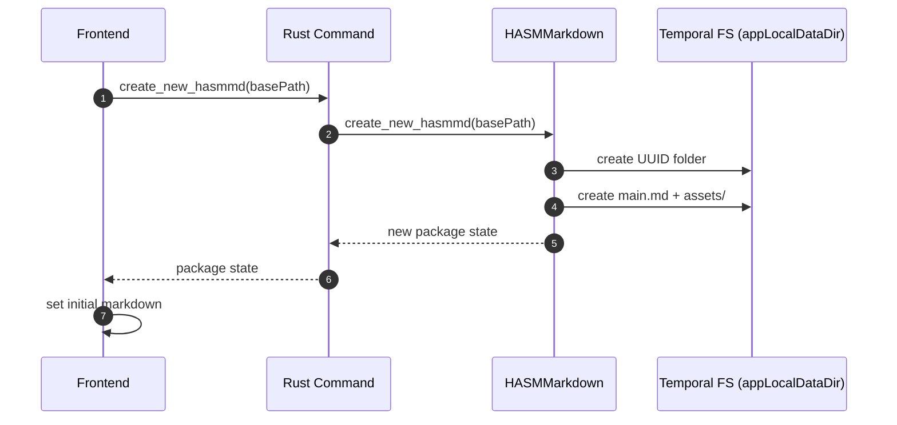
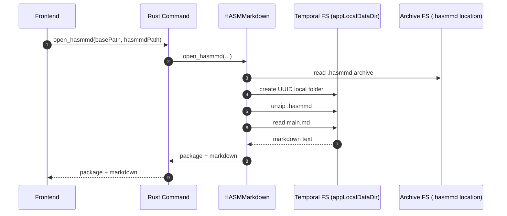
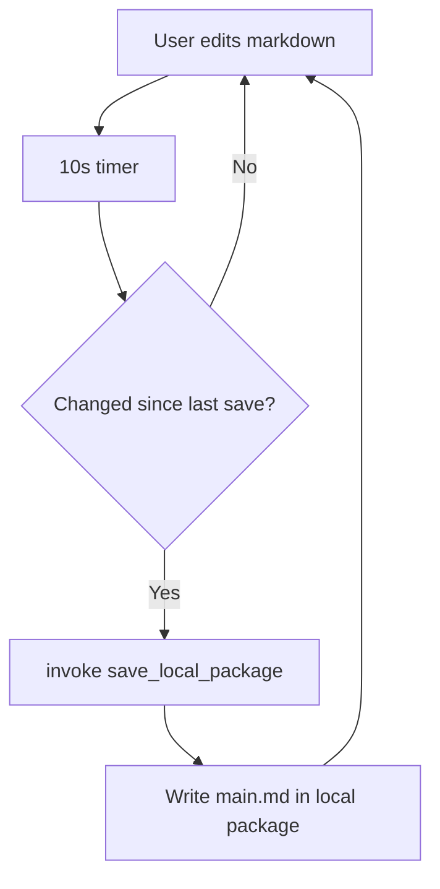
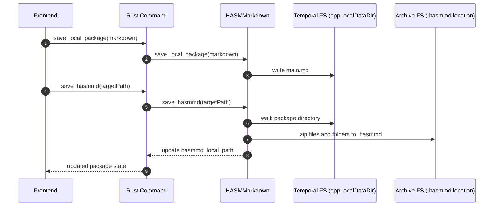

# Create Open Save Flows

This document explains the core runtime flows for create, open, autosave, and save as.

Storage layers used in these flows:

- Temporal layer: `appLocalDataDir` workspace used for extraction and editing.
- Archive layer: user file locations for `.hasmmd` (default dialog location uses `documentDir`).

## Create new package on startup

## Open existing archive

## Autosave loop

## Save As portable archive

