# App Launch, Import, and Workspace Verification

## 1. Sequence Overview

This sequence handles the application startup lifecycle from CLI/OS launch up to populating the React State Store, acquiring OS-level exclusive file handles, and rendering the primary Markdown editor (`/editor`).

### Key Operations Covered

1. **Multi-Instance Execution & Workspace Process Isolation:** Allows multiple application instances to run simultaneously across the OS. However, opening a specific workspace is strictly limited to a single process at a time via PID `.lock` validation and OS-level exclusive file locks.
2. **CLI Execution & App Version Validation:** Accepts optional CLI arguments (`hasm_markdown [target_path]`). Reads app version metadata and routes to `/error-app` if corrupted.
3. **React Loading State Management:** Sets `isLoading: true` and `loadingProgress: 0` before long-running imports to disable UI buttons and prevent double clicks.
4. **Target Entry Mode Routing:**
* **Mode A (ZIP Archive `.hasmmd`):** Extracts contents into `<AppLocalDataDir>/<UUID>/`.
* **Mode B (Folder Workspace):** Copies directory recursively into `<AppLocalDataDir>/<UUID>/`.
* **Mode C (Create New):** Scaffolds default `main.md`, `assets.json`, and `assets/` directory in App Local.


5. **Dynamic Timeout & Stall Guard:** Emits `import_progress` events every chunk. Resets the stall countdown timer as long as bytes are being written. Times out only if write operations freeze for more than 15 seconds.
6. **Exclusive Process Lock & Essential File OS Handles:**
* Writes `<UUID>/.lock` storing the active Process ID (PID). If another active process PID holds the lock, aborts loading to prevent concurrent workspace access.
* Acquires exclusive OS write/delete file handles over `<UUID>/main.md`, `<UUID>/assets.json`, and the source `.hasmmd` archive (if Mode A).


7. **Structural Verification & Non-Fatal Asset Cross-Check:**
* Verifies physical existence of `main.md`, `assets.json`, and `assets/`. (Fatal if missing core structures).
* **Missing Assets Check (Non-Fatal):** Cross-checks `assets.json` against physical files in `assets/`. Missing files are collected into `missing_assets` without halting.
* **Orphan Files Check (Non-Fatal):** Scans `assets/` for unregistered files and collects them into `orphan_files`.


8. **State Commitment & Direct Editor Navigation:** Commits `PackageStatePayload` (carrying missing asset details and warnings) to `usePackageStore`, resets `isLoading: false`, and directly routes to `/editor`.

---

## 2. Sequence Diagram

```mermaid
sequenceDiagram
    autonumber
    actor User
    participant CLI as OS / CLI Terminal
    participant React as Frontend (React / UI Store)
    participant Rust as Backend (Tauri / Rust Core)
    participant AppLocal as App Local Storage (<AppLocalDataDir>/<UUID>/)
    participant ExtStorage as Archive / External Storage (.hasmmd / Folder)

    %% Phase 1: CLI Launch & App Version Validation
    User->>CLI: Execute `hasm_markdown [target_path]` (Multi-instance permitted)
    CLI->>Rust: Launch Process Instance with CLI Arguments
    activate Rust
    
    Rust->>Rust: Read Application Version Metadata
    alt Invalid Application Version
        Rust->>React: Launch with Version Error Flag
        activate React
        React->>User: Render System Error Page (/error-app)
        deactivate React
    else Version Valid
        Rust->>React: Launch Application Window with CLI Context
    end
    deactivate Rust

    %% Phase 2: Selection & Mode-Specific Imports (With Progress & Stall Timeout)
    activate React
    alt Route 2-A: ZIP Archive Mode (.hasmmd)
        alt CLI Path Provided
            React->>React: setIsLoading(true, "Extracting archive...")
            React->>React: Listen to "import_progress" event
            React->>Rust: invoke("import_archive", { archive_path: cli_target_path })
        else UI Selection
            React->>User: Render File Selection Page (/select)
            User->>React: Select .hasmmd / .zip File
            React->>React: setIsLoading(true, "Extracting archive...")
            React->>React: Listen to "import_progress" event
            React->>Rust: invoke("import_archive", { archive_path })
        end
        deactivate React
        activate Rust
        
        Rust->>AppLocal: Generate new UUID & Create directory <AppLocalDataDir>/<UUID>/
        Rust->>Rust: Calculate Dynamic Timeout based on Archive Size + Stall Guard
        
        loop Unzip Chunk / File Copy
            Rust->>ExtStorage: Read & Extract Zip Chunk
            ExtStorage-->>AppLocal: Write file
            Rust->>Rust: Reset Stall Timer (Countdown reset on progress)
            Rust-->>React: emit("import_progress", { percentage, current_file, processed_bytes, total_bytes })
            React->>React: setLoadingProgress(percentage)
        end

    else Route 2-B: Folder Workspace Mode
        activate React
        alt CLI Path Provided
            React->>React: setIsLoading(true, "Copying workspace folder...")
            React->>React: Listen to "import_progress" event
            React->>Rust: invoke("import_folder", { folder_path: cli_target_path })
        else UI Selection
            React->>User: Render File Selection Page (/select)
            User->>React: Select External Folder Directory
            React->>React: setIsLoading(true, "Copying workspace folder...")
            React->>React: Listen to "import_progress" event
            React->>Rust: invoke("import_folder", { folder_path })
        end
        deactivate React
        activate Rust
        
        Rust->>AppLocal: Generate new UUID & Create directory <AppLocalDataDir>/<UUID>/
        Rust->>Rust: Calculate Dynamic Timeout based on Total Directory Size
        
        loop File Copy
            Rust->>ExtStorage: Read file
            ExtStorage-->>AppLocal: Copy file
            Rust->>Rust: Reset Stall Timer (Countdown reset on progress)
            Rust-->>React: emit("import_progress", { percentage, current_file, processed_bytes, total_bytes })
            React->>React: setLoadingProgress(percentage)
        end

    else Route 2-C: Create New Mode
        activate React
        React->>User: Render File Selection Page (/select)
        User->>React: Select "Create New HASM Markdown"
        React->>React: setIsLoading(true, "Scaffolding new workspace...")
        React->>Rust: invoke("create_new_package")
        deactivate React
        activate Rust
        
        Rust->>AppLocal: Generate new UUID & Create directory <AppLocalDataDir>/<UUID>/
        Rust->>AppLocal: Scaffold initial main.md, assets.json, and assets/ directory
        Rust->>Rust: Set StorageTarget::Unbound
    end

    %% Stall Detection / Failure Branch
    alt Import Stalled (No byte written for > 15s) or IO Error
        Rust->>AppLocal: Purge Incomplete <UUID>/ Directory
        Rust-->>React: Return PackageError::ImportStalled / IoError
        activate React
        React->>React: setIsLoading(false)
        React->>User: Display Toast Error ("Import Stalled or Failed") & Stay on /select
        deactivate React
    end

    %% Phase 3: Single-Instance Workspace Lock & OS File Handle Acquisition
    Rust->>AppLocal: Read <UUID>/.lock
    alt Lock File Exists with Active Process PID
        AppLocal-->>Rust: Active PID detected in OS process table
        Rust-->>React: Return PackageError::WorkspaceLocked
        activate React
        React->>React: setIsLoading(false)
        React->>User: Display Lock Conflict Modal ("Workspace already open in another window")
        deactivate React
    else Workspace Free
        Rust->>AppLocal: Write <UUID>/.lock (PID: current_process_id)
        
        %% Core File Physical Locks
        Rust->>AppLocal: Open Exclusive Write File Handle on <UUID>/main.md
        Rust->>AppLocal: Open Exclusive Write File Handle on <UUID>/assets.json
        opt Mode A (ZIP Target)
            Rust->>ExtStorage: Open Exclusive Read/Share Lock on target .hasmmd archive
        end
    end

    Rust->>AppLocal: Read <UUID>/assets.json
    AppLocal-->>Rust: Return assets.json content
    Rust->>Rust: Parse assets.json -> AssetManifest (HashMap<String, AssetMetadata>)

    %% Phase 4: Structural Verification, Cross-Check & React State Commitment
    Rust->>AppLocal: Check existence of main.md, assets.json, and assets/
    alt Structure Check Failed (Missing main.md, assets.json, or assets/ directory entirely)
        AppLocal-->>Rust: Core File or Directory Missing
        Rust-->>React: Return PackageValidationError::MissingMainMarkdown / MissingAssetsJson / InvalidAssetDirectory
        activate React
        React->>React: setIsLoading(false)
        React->>User: Render Data Error Page (/error-model)
        deactivate React
    else Core Structure Intact
        Rust->>AppLocal: Cross-check manifest entries against assets/ physical files
        opt Missing Physical Files
            Rust->>Rust: Collect missing asset details into Vec<MissingAssetInfo>
        end
        
        Rust->>AppLocal: Scan assets/ for unregistered orphan files
        opt Orphan Files Found
            Rust->>Rust: Collect orphan filenames into Vec<PackageWarning>
        end
        
        Rust->>Rust: Store HasmMarkdownPackage into Mutex<Option<HasmMarkdownPackage>>
        Rust-->>React: Return Ok(PackageStatePayload { ..., missing_assets, warnings })
        deactivate Rust
        
        %% React State Commitment & Direct Editor Route
        activate React
        React->>React: setPackageStore(payload) [Update React Context / Zustand Store]
        React->>React: Initialize markdown-it with manifest asset map & missing assets list
        React->>React: setIsLoading(false)
        React->>User: Render Markdown Editor Page (/editor) [Delegates missing asset red text styling & FS Watcher to SEQ-MD-02]
        deactivate React
    end

```



---

## 3. Data Contracts & State Specifications

### 3.1 React UI State (`usePackageStore`)

```typescript
export interface PackageUIState {
  isLoading: boolean;              // Global blocking loading flag
  loadingMessage: string | null;   // Active loading label
  loadingProgress: number;        // Progress percentage (0 to 100)
  packageData: PackageStatePayload | null; // Active workspace data (includes missing_assets)
  error: PackageError | PackageValidationError | null; // Fatal system errors only
}

```

### 3.2 Response Payload (`PackageStatePayload`)

```typescript
export interface MissingAssetInfo {
  alias: string;             // Display name referenced in Markdown (e.g. "diagram.png")
  expectedFilename: string;  // Expected physical UUID filename (e.g. "3f8b9a20-1c2d.png")
}

export interface PackageStatePayload {
  uuid: string;                     // Temporary workspace UUID
  tempDirPath: string;              // Absolute path to <AppLocalDataDir>/<UUID>/
  targetType: 'Archive' | 'Folder' | 'Unbound'; // StorageTarget variant
  targetPath: string | null;        // Active master target path on disk
  isDirty: boolean;                 // Initial unsaved changes flag (false)
  manifest: {
    version: string;
    assets: Record<string, {
      uuid: string;
      filename: string;
      mimeType: string;
      createdAt: number;
    }>;
  };
  missingAssets: MissingAssetInfo[];// Non-fatal list of referenced assets with missing physical files
  warnings: PackageWarning[];       // Non-fatal warnings (e.g., orphan files)
}

```

---

## 4. Error Handling & Multi-Instance Lock Strategy

1. **Multi-Instance Coexistence:**
* Multiple `hasm_markdown` process windows can exist independently on the OS simultaneously.
* Multi-instance conflict validation is isolated strictly per workspace via `<UUID>/.lock` (PID check) and OS-level file handle reservation.


2. **Core File OS Physical Locking:**
* **`main.md` & `assets.json`:** Opened with OS exclusive write/delete file handles (`FILE_SHARE_READ` allowed, write/delete blocked for external processes) for the duration of the editor session.
* **ZIP Archive Target (`.hasmmd`):** Exclusive read lock prevents external users from moving, renaming, or deleting the source archive while active.
* **Asset Images (`assets/*`):** Left physically unlocked to permit external graphics software editing, relying on `SEQ-MD-02` FileSystem Watchers (`notify`) for non-destructive hot-reloading.


3. **Error & Lock Conflict Matrix:**

| Scenario | Component | Action | Resulting UI / State |
| --- | --- | --- | --- |
| **App Version Read Failure** | Rust Backend | Catch version reading error | Redirect to `/error-app` screen |
| **Import Stalled (> 15s No I/O)** | Rust Backend | Trigger Stall Guard, purge `<UUID>/` | Set `isLoading: false`, show Toast error |
| **Workspace Already Open in Active PID** | Rust Backend | Detect existing active PID in `.lock` | Set `isLoading: false`, show Lock Conflict Modal |
| **`main.md` / `assets.json` Lock Failure** | Rust Backend | File locked by another process | Set `isLoading: false`, show File Lock Toast error |
| **Missing `main.md` / `assets.json**` | Rust Backend | Fail `verify_structure()` | Set `isLoading: false`, redirect to `/error-model` |
| **Missing Physical Asset File(s)** | Rust Backend | Collect missing aliases into `missingAssets` | Route directly to `/editor` (Red-text handled by `SEQ-MD-02`) |