# App Launch, Import, and Workspace Verification

## 1. Sequence Overview

This sequence handles the application startup lifecycle from CLI/OS launch up to populating the React State Store, establishing single-instance workspace process locking, acquiring exclusive OS file handles, **resolving asset relative paths into runtime absolute paths (`resolvedPath`)**, and rendering the Markdown editor (`/editor`).

### Key Operations Covered

1. **Multi-Instance Execution & Workspace Process Isolation:** Permits multiple application process windows across the OS while restricting access to a specific workspace directory to a single active process via PID `.lock` validation.
2. **Selective Lightweight Import & Zero-Copy Asset Streaming:**
* **Mode A (ZIP Target `.hasmmd`):** Extracts **only** lightweight metadata (`main.md` and `assets.json`) into `<AppLocalDataDir>/<UUID>/`. Asset images are **not** extracted upfront; they are read via dynamic on-demand stream directly from the ZIP archive.
* **Mode B (Folder Workspace):** Mounts external directories directly or copies metadata without duplicating heavy media payloads.
* **Mode C (Create New):** Scaffolds default `main.md`, `assets.json`, and empty `assets/` in App Local.


3. **Single-Workspace Process Lock & Essential File OS Handles:**
* Writes `<UUID>/.lock` storing the active Process ID (PID). Rejects access if another active process PID holds the lock.
* Acquires exclusive OS write file handles over `<UUID>/main.md` and `<UUID>/assets.json`, plus an exclusive read/share lock on the source `.hasmmd` archive.


4. **Runtime Absolute Path Resolution (`relativePath` $\rightarrow$ `resolvedPath`):**
* Reads `assets.json` containing portable package-relative paths (`assets/<uuid_filename>`).
* Rust dynamically expands every relative entry into an active runtime absolute path (`resolvedPath`), binding it to the current OS environment (e.g. `App Local` path, external folder path, or `asset-stream://` URI) in memory before handing off to React.


5. **Structural Verification & Non-Fatal Asset Cross-Check:**
* Verifies physical existence of `main.md` and `assets.json`.
* Cross-checks `assets.json` entries against the ZIP archive index or external directory. Missing asset references are collected into `missingAssets` without blocking workspace loading.


6. **State Commitment & Direct Editor Navigation:** Commits `PackageStatePayload` (carrying resolved absolute paths) to `usePackageStore`, resets `isLoading: false`, and directly routes to `/editor`.

---

## 2. Sequence Diagram

```mermaid
sequenceDiagram
    autonumber
    actor User
    participant CLI as OS / CLI Terminal
    participant React as Frontend (React / UI Store)
    participant Rust as Backend (Tauri / Rust Core)
    participant AppLocal as App Local Storage (<AppLocalDataDir>/<UUID>/)
    participant ExtStorage as Archive / External Storage (.hasmmd / Folder)

    %% Phase 1: CLI Launch & App Version Validation
    User->>CLI: Execute `hasm_markdown [target_path]` (Multi-instance permitted)
    CLI->>Rust: Launch Process Instance with CLI Arguments
    activate Rust
    
    Rust->>Rust: Read Application Version Metadata
    alt Invalid Application Version
        Rust->>React: Launch with Version Error Flag
        activate React
        React->>User: Render System Error Page (/error-app)
        deactivate React
    else Version Valid
        Rust->>React: Launch Application Window with CLI Context
    end
    deactivate Rust

    %% Phase 2: Selection & Selective Lightweight Import (Metadata Only)
    activate React
    alt Route 2-A: ZIP Archive Mode (.hasmmd)
        alt CLI Path Provided
            React->>React: setIsLoading(true, "Opening workspace archive...")
            React->>Rust: invoke("open_archive_workspace", { archive_path: cli_target_path })
        else UI Selection
            React->>User: Render File Selection Page (/select)
            User->>React: Select .hasmmd / .zip File
            React->>React: setIsLoading(true, "Opening workspace archive...")
            React->>Rust: invoke("open_archive_workspace", { archive_path })
        end
        deactivate React
        activate Rust
        
        Rust->>AppLocal: Generate new UUID & Create directory <AppLocalDataDir>/<UUID>/
        
        %% Selective Extraction: Metadata Only (Instant Open)
        Rust->>ExtStorage: Scan ZIP Index (Central Directory)
        Rust->>ExtStorage: Extract main.md & assets.json ONLY to <UUID>/
        Note over Rust,ExtStorage: Asset binaries remain in ZIP for on-demand streaming (Zero Upfront Copy)

    else Route 2-B: Folder Workspace Mode
        activate React
        alt CLI Path Provided
            React->>React: setIsLoading(true, "Mounting workspace folder...")
            React->>Rust: invoke("open_folder_workspace", { folder_path: cli_target_path })
        else UI Selection
            React->>User: Render File Selection Page (/select)
            User->>React: Select External Folder Directory
            React->>React: setIsLoading(true, "Mounting workspace folder...")
            React->>Rust: invoke("open_folder_workspace", { folder_path })
        end
        deactivate React
        activate Rust
        
        Rust->>AppLocal: Generate new UUID & Create directory <AppLocalDataDir>/<UUID>/
        Rust->>ExtStorage: Read main.md & assets.json from Folder -> Mount directly

    else Route 2-C: Create New Mode
        activate React
        React->>User: Render File Selection Page (/select)
        User->>React: Select "Create New HASM Markdown"
        React->>React: setIsLoading(true, "Scaffolding new workspace...")
        React->>Rust: invoke("create_new_package")
        deactivate React
        activate Rust
        
        Rust->>AppLocal: Generate new UUID & Create directory <AppLocalDataDir>/<UUID>/
        Rust->>AppLocal: Scaffold initial main.md, assets.json, and empty assets/ directory
        Rust->>Rust: Set StorageTarget::Unbound
    end

    %% Phase 3: Single-Instance Lock, OS Handles & Runtime Path Resolution
    Rust->>AppLocal: Read <UUID>/.lock
    alt Lock File Exists with Active Process PID
        AppLocal-->>Rust: Active PID detected in OS process table
        Rust-->>React: Return PackageError::WorkspaceLocked
        activate React
        React->>React: setIsLoading(false)
        React->>User: Display Lock Conflict Modal ("Workspace already open in another window")
        deactivate React
    else Workspace Free
        Rust->>AppLocal: Write <UUID>/.lock (PID: current_process_id)
        
        %% Core File Physical Locks & ZIP Share Lock
        Rust->>AppLocal: Open Exclusive Write File Handle on <UUID>/main.md
        Rust->>AppLocal: Open Exclusive Write File Handle on <UUID>/assets.json
        opt Mode A (ZIP Target)
            Rust->>ExtStorage: Open Exclusive Read/Share Lock on target .hasmmd archive (Keep File Handle Open for Streaming)
        end
    end

    Rust->>AppLocal: Read <UUID>/assets.json
    AppLocal-->>Rust: Return relative assets.json content
    
    %% Runtime Absolute Path Expansion Step
    loop Expand Relative Paths to Runtime Absolute Paths
        alt Mode A (ZIP Target)
            Rust->>Rust: Bind relativePath -> resolvedPath ("asset-stream://<UUID>/<asset_uuid>")
        else Mode B / Mode C (Folder / Local Target)
            Rust->>Rust: Join workspace root path + relativePath -> resolvedPath (Absolute OS Path)
        end
    end
    
    Rust->>Rust: Cache expanded RuntimeAssetManifest (HashMap<Alias, RuntimeAssetMetadata>)

    %% Phase 4: Verification, Asset Index Cross-Check & State Commitment
    Rust->>AppLocal: Check existence of main.md and assets.json
    alt Core Metadata Missing
        AppLocal-->>Rust: main.md or assets.json Missing
        Rust-->>React: Return PackageValidationError::MissingMainMarkdown / MissingAssetsJson
        activate React
        React->>React: setIsLoading(false)
        React->>User: Render Data Error Page (/error-model)
        deactivate React
    else Core Metadata Intact
        Rust->>ExtStorage: Cross-check manifest asset keys against ZIP index / external assets/
        opt Referenced Asset Missing from Archive Index or Disk
            Rust->>Rust: Collect missing asset details into Vec<MissingAssetInfo>
        end
        
        Rust->>Rust: Store HasmMarkdownPackage into Mutex<Option<HasmMarkdownPackage>>
        Rust-->>React: Return Ok(PackageStatePayload { manifest_with_resolved_paths, missing_assets, warnings })
        deactivate Rust
        
        %% React State Commitment & Direct Editor Route
        activate React
        React->>React: setPackageStore(payload) [Commit store with runtime resolved absolute paths]
        React->>React: Initialize markdown-it with manifest asset map & missing assets list
        React->>React: setIsLoading(false)
        React->>User: Render Markdown Editor Page (/editor) [Uses resolvedPath for zero-delay preview rendering]
        deactivate React
    end

```



---

## 3. Data Contracts & State Specifications

### 3.1 Runtime Asset Manifest Payload (`PackageStatePayload`)

```typescript
export interface RuntimeAssetMetadata {
  uuid: string;             // Asset UUID
  relativePath: string;     // Portable package relative path (e.g., "assets/3f8b9a20.png")
  resolvedPath: string;     // Absolute runtime path (e.g., "C:\Users\...\assets\3f8b9a20.png" or "asset-stream://<UUID>/<asset_uuid>")
  mimeType: string;         // MIME string
  size: number;             // Byte size
  isExternal: boolean;      // True if referencing external OS file directly
}

export interface PackageStatePayload {
  uuid: string;                     // Temporary workspace UUID
  tempDirPath: string;              // Absolute path to <AppLocalDataDir>/<UUID>/
  targetType: 'Archive' | 'Folder' | 'Unbound'; // StorageTarget variant
  targetPath: string | null;        // Active master target path on disk (.hasmmd path)
  isDirty: boolean;                 // Initial unsaved changes flag (false)
  manifest: {
    version: string;
    assets: Record<string, RuntimeAssetMetadata>; // Maps Alias -> Runtime Metadata containing absolute resolvedPath
  };
  missingAssets: MissingAssetInfo[];// Referenced assets missing from ZIP index or folder
  warnings: PackageWarning[];       // Unregistered orphan assets in ZIP
}

```

---

## 4. Path Resolution Strategy Rules

1. **Relative Storage on Disk:**
`assets.json` stored on disk inside `.hasmmd` or workspace folders **always** uses workspace-relative paths (`assets/<uuid_filename>`) for maximum portability across operating systems and users.
2. **Absolute Resolution in Memory:**
During startup (Phase 3 of `SEQ-MD-01`), Rust parses `assets.json` and dynamically resolves every `relativePath` into an environment-specific absolute `resolvedPath`.
3. **Seamless Hand-off to Frontend:**
React receives `PackageStatePayload` pre-populated with `resolvedPath`, eliminating the need for client-side path calculations and guaranteeing instant image preview rendering upon mounting `/editor`.