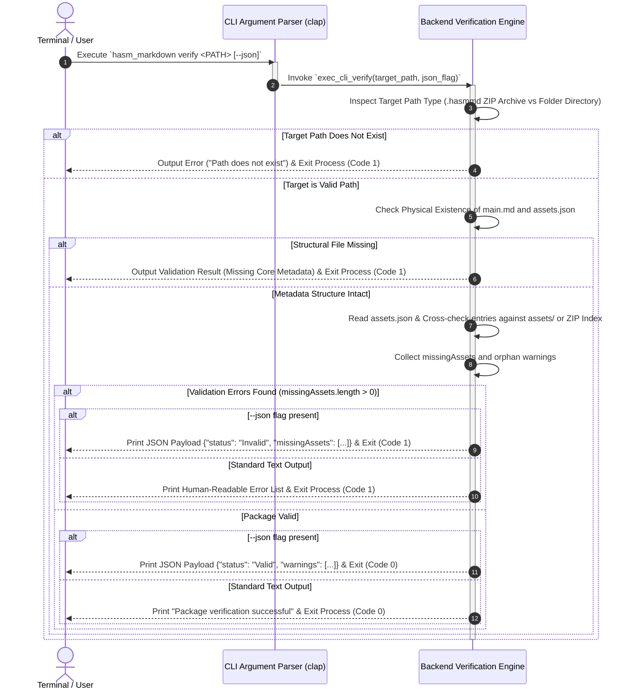
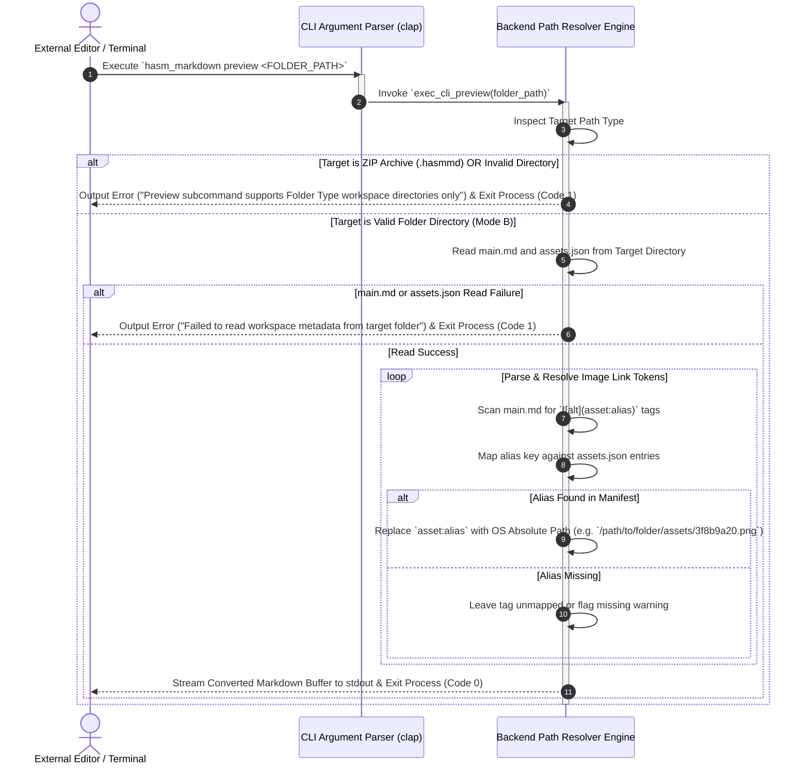
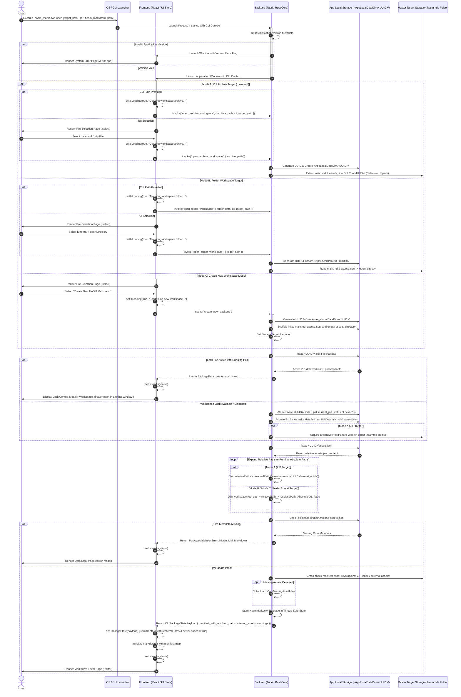

# SEQ-MD-01: App Launch, CLI Interface, Selective Import, Workspace Locking, and Path Resolution

## 1. Sequence Overview

This sequence handles the application startup lifecycle from CLI/OS launch up to populating the React State Store, establishing single-instance workspace process locking, acquiring exclusive OS file handles, **resolving asset relative paths into runtime absolute paths (`resolvedPath`)**, and executing non-GUI CLI subcommands or rendering the Markdown editor (`/editor`).

### Key Operations Covered

1. **CLI Subcommand Router (`verify`, `preview`, `open`):**
* **`verify <PATH>`:** Executes headless non-GUI verification of a `.hasmmd` archive or folder workspace, outputting structural errors/warnings to `stdout`/JSON and exiting with code `0` or `1`.


* **`preview <FOLDER_PATH>`:** Enforces **Folder Type Only (Mode B)** execution. Reads `main.md` and `assets.json`, resolves relative asset tags (``) to OS absolute file paths, and outputs the converted Markdown stream to `stdout` for external editor compatibility.
* **`open <PATH>`:** Launches the full interactive GUI application window, initiating selective import and state store commitment.


2. **Multi-Instance Execution & Workspace Process Isolation:** Permits multiple application process windows across the OS while restricting access to a specific workspace directory to a single active process via PID `.lock` validation.


3. **Selective Lightweight Import & Zero-Copy Asset Streaming:**
* **Mode A (ZIP Target `.hasmmd`):** Extracts **only** lightweight metadata (`main.md` and `assets.json`) into `<AppLocalDataDir>/<UUID>/`. Asset images are read via dynamic on-demand stream directly from the ZIP archive (`asset-stream://`).


* **Mode B (Folder Workspace):** Mounts external directories directly or copies metadata without duplicating heavy media payloads.


* **Mode C (Create New):** Scaffolds default `main.md`, `assets.json`, and empty `assets/` in App Local.


4. **Single-Workspace Process Lock & Essential File OS Handles:**
* Writes `<UUID>/.lock` storing the active Process ID (PID). Rejects access if another active process PID holds the lock.


* Acquires exclusive OS write file handles over `<UUID>/main.md` and `<UUID>/assets.json`, plus an exclusive read/share lock on the source `.hasmmd` archive.


5. **Runtime Absolute Path Resolution (`relativePath` $\rightarrow$ `resolvedPath`):**
* Reads `assets.json` containing portable package-relative paths (`assets/<uuid_filename>`).


* Rust dynamically expands every relative entry into an active runtime absolute path (`resolvedPath`), binding it to the current OS environment in memory.


6. **State Commitment & Direct Editor Navigation:** Commits `PackageStatePayload` (carrying resolved absolute paths) to `usePackageStore`, sets `isLoaded: true`, and directly routes to `/editor`.


---

## 2. Sequence Diagrams by CLI Subcommand

### 2.1 Subcommand A: `hasm_markdown verify <PATH> [--json]` (Non-GUI Verification)



---

### 2.2 Subcommand B: `hasm_markdown preview <FOLDER_PATH>` (Folder-Only Absolute Path Stream)



---

### 2.3 Subcommand C: `hasm_markdown open <PATH>` / Interactive Desktop GUI Startup



---

## 3. Data Contracts & State Specifications

### 3.1 CLI Verification Output Format (`hasm_markdown verify --json`)

```json
{
  "status": "Invalid",
  "targetPath": "/path/to/my_package.hasmmd",
  "missingAssets": [
    {
      "alias": "architecture_diagram.png",
      "expectedRelativePath": "assets/3f8b9a20-1c2d-4e5f.png",
      "referencedLines": [12, 45]
    }
  ],
  "warnings": [
    {
      "code": "OrphanAssetFound",
      "filename": "assets/9e8d7c6b-5a4f-3e2d.png"
    }
  ]
}

```

### 3.2 Runtime Asset Manifest Payload (`PackageStatePayload`)

```typescript
export interface RuntimeAssetMetadata {
  uuid: string;             // Asset UUID
  relativePath: string;     // Portable package relative path (e.g., "assets/3f8b9a20.png")
  resolvedPath: string;     // Absolute runtime path (e.g., "C:\Users\...\assets\3f8b9a20.png" or "asset-stream://<UUID>/<asset_uuid>")
  mimeType: string;         // MIME string
  size: number;             // Byte size
  isExternal: boolean;      // True if referencing external OS file directly
  isDeleted: boolean;       // Soft deletion flag
}

export interface PackageStatePayload {
  uuid: string;                     // Temporary workspace UUID
  tempDirPath: string;              // Absolute path to <AppLocalDataDir>/<UUID>/
  targetType: 'Archive' | 'Folder' | 'Unbound'; // StorageTarget variant
  targetPath: string | null;        // Active master target path on disk (.hasmmd path or folder path)
  isDirty: boolean;                 // Initial unsaved changes flag (false)
  manifest: {
    version: string;
    assets: Record<string, RuntimeAssetMetadata>; // Maps Alias -> Runtime Metadata containing absolute resolvedPath
  };
  missingAssets: MissingAssetInfo[];// Referenced assets missing from ZIP index or folder
  warnings: PackageWarning[];       // Unregistered orphan assets in workspace
}

```

---

## 4. Path Resolution & CLI Execution Guard Rules

1. **Heading-Based Subcommand Routing:**
* `hasm_markdown verify <PATH>` is completely non-interactive; it executes headless verification and outputs diagnostics directly to terminal streams.


* `hasm_markdown preview <FOLDER_PATH>` guarantees Folder Type exclusivity; execution on ZIP archives is rejected immediately with an informative error message.
* `hasm_markdown open <PATH>` bootstraps the GUI layer and routes directly to `/editor`.


2. **Relative Storage on Disk vs Absolute Resolution in Memory:**
`assets.json` stored on disk inside `.hasmmd` or workspace folders **always** uses workspace-relative paths (`assets/<uuid_filename>`) for maximum portability across operating systems. Rust dynamically resolves `relativePath` into environment-specific `resolvedPath` URIs upon startup.