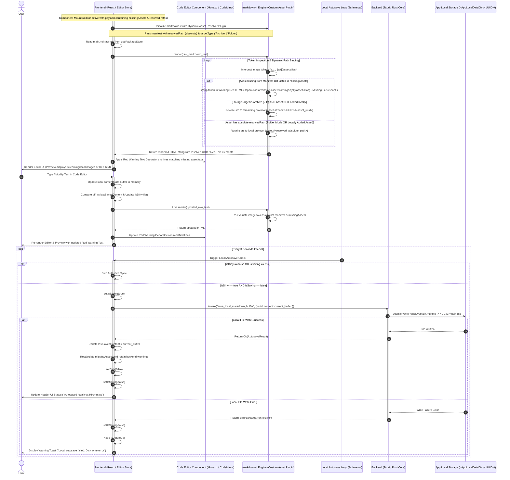

# Text Editing, Dynamic Asset Path Resolution, Missing Asset Red-Highlighting, and Local Autosave

## 1. Sequence Overview

This sequence handles the real-time text editing operational lifecycle within the primary Markdown Editor screen (`/editor`). To protect system responsiveness and prevent unintended high I/O spikes caused by heavy archive re-compression, **all `Ctrl+S` manual save shortcuts are explicitly removed**. The 3-second periodic autosave loop focuses strictly on fast, lightweight local updates (`main.md` and `assets.json` in `App Local`). Full package packaging, asset copying, and ZIP archive writing are delegated exclusively to **`SEQ-MD-04` (User-Triggered Save Action)**.

### Key Operations Covered

1. **Component Mount & Dynamic Path Resolution:** Resolving local image tokens (``) to active runtime absolute paths (`resolvedPath`) or `asset-stream://` archive streaming URIs provided by `usePackageStore`.
2. **Missing Asset Red-Text Highlighting:** Evaluating image tokens against `missingAssets`. Re-rendering missing asset markup with warning red CSS spans in preview and red line decorators in the code editor.
3. **Real-time Text Editing & Diff Tracking:** Updating live buffers (`rawContent`) in memory and tracking modified states (`isDirty`) against the last saved buffer.
4. **3-Second Periodic Local-Only Autosave Loop:** Periodically persisting the text buffer to `<UUID>/main.md` in `App Local` via atomic file operations without invoking heavy external archiving processes.
5. **Independent Editor Appearance and Syntax Colors:** Rendering one syntax-colored `contenteditable` Markdown surface with locally persisted Light or Dark editor appearance independent from the application color pattern.

---

## 2. Sequence Diagram



---

## 3. Data Contracts & State Specifications

The current React implementation keeps one lightweight `contenteditable` Markdown editor. Its rendered spans color Markdown headings, markers, links/assets, inline code, strong text, and emphasis in the same surface that accepts input, so wrapping stays aligned with the line-number gutter. The preview uses a `markdown-it` asset resolver plugin. The editor Light/Dark appearance persists independently from the application color pattern. Active folder assets use `asset://<resolvedPath>`, archive assets retain `asset-stream://<UUID>/<asset_uuid>`, and missing or soft-deleted aliases render as escaped `.missing-asset-warning` spans.

### 3.1 Editor Local State (`usePackageStore` / Editor Context)

```typescript
export interface EditorState {
  rawContent: string;           // Active live buffer in editor
  lastSavedContent: string;     // Content buffer at last successful local autosave or save action
  isDirty: boolean;             // Computed as (rawContent !== lastSavedContent)
  isSaving: boolean;            // Lock flag preventing concurrent save/autosave calls
  lastAutosavedAt: number | null;// Unix timestamp of last successful local autosave
  missingAssets: MissingAssetInfo[]; // Active list of referenced assets missing physical files
  manifest: RuntimeAssetManifest;   // Maps Alias -> Runtime Metadata containing absolute resolvedPath
}

```

### 3.2 Backend Command Interface (`save_local_markdown_buffer`)

```typescript
// Tauri IPC Invocation Payload for Local Fast Autosave
export interface SaveLocalMarkdownBufferArgs {
  uuid: string;         // Active workspace UUID
  content: string;      // UTF-8 plain text string of main.md
}

export type SaveLocalMarkdownBufferResult = 
  | { status: "Ok"; savedAt: number }
  | { status: "Err"; error: "IoError" | "WorkspaceLocked" };

```

---

## 4. Operational Guard & Responsiveness Rules

1. **Total Elimination of `Ctrl+S` Keyboard Shortcut:**
The application explicitely unbinds and intercepts `Ctrl+S` / `Cmd+S` keydown events within the editor component to prevent accidental execution of long-running file operations.
2. **Strict Local Isolation of Autosave:**
The 3-second periodic autosave loop is strictly bounded to writing plain UTF-8 text to `<UUID>/main.md` in `App Local`. After a successful save it re-scans the saved buffer for missing/deleted asset references and retains backend warning records without replacing the mounted manifest or gutter visual state from a partial autosave response. It **never** invokes ZIP re-compression, archive updates, or heavy asset file copying.
3. **Save Action Offloading:**
All heavy persistence tasks (normalizing relative paths, syncing added/deleted assets, writing back to target folders, or re-building `.hasmmd` ZIP archives) are offloaded exclusively to **`SEQ-MD-04`**, triggered only by an explicit user click on the UI "Save Package" button.