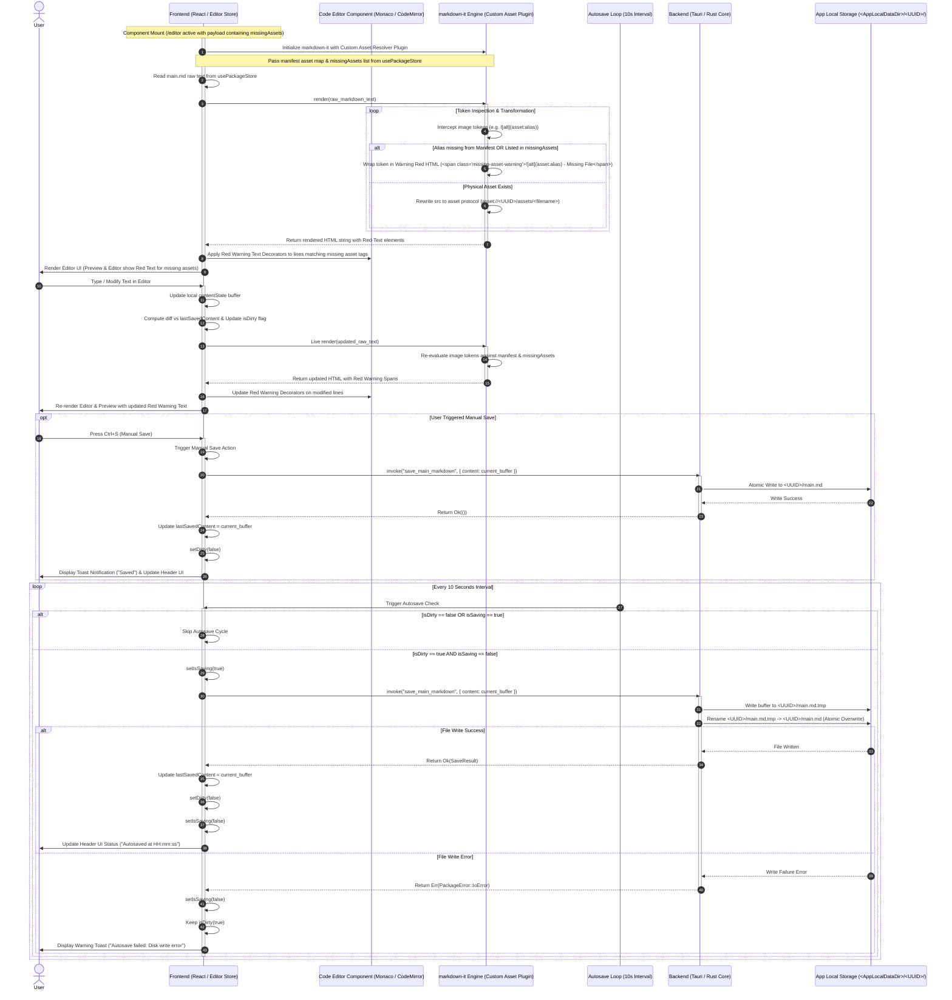

# Text Editing, Custom Markdown Asset Resolution, Missing Asset Red-Highlighting, and Autosave

## 1. Sequence Overview

This sequence handles the operational lifecycle within the primary Markdown Editor screen (`/editor`). Since `main.md` and `assets.json` are secured under exclusive OS file locks during active sessions, external file modification is prevented by design. This sequence focuses strictly on:

1. **Component Mount & Custom `markdown-it` Plugin Path Resolution:** Upon `/editor` mount, resolving local alias image markup (e.g., ``) to `App Local` protocol URLs using the in-memory manifest cached in `usePackageStore`.
2. **Missing Asset Red-Text Styling (Preview & Code Editor):** Evaluating image tokens against `missingAssets`. Re-rendering missing asset markup with a warning red-text CSS class in the preview pane, and decorating the corresponding code lines in the code editor with red warning markers.
3. **Real-time Editing & Diff Tracking:** Processing user typing input, re-evaluating missing asset tags on the fly, updating local UI State, and calculating the `isDirty` flag against the last saved buffer.
4. **Manual Save (`Ctrl+S`) & 10-Second Periodic Autosave Loop:** Periodically writing text buffers safely to `<UUID>/main.md` via atomic write/rename operations without blocking UI responsiveness.

---

## 2. Sequence Diagram



---

## 3. Data Contracts & State Specifications

### 3.1 Editor Local State (`usePackageStore` / Editor Context)

```typescript
export interface EditorState {
  rawContent: string;           // Active live buffer in editor
  lastSavedContent: string;     // Content buffer at last successful save/load
  isDirty: boolean;             // Computed as (rawContent !== lastSavedContent)
  isSaving: boolean;            // Lock flag preventing concurrent save calls
  lastAutosavedAt: number | null;// Unix timestamp of last successful save
  missingAssets: MissingAssetInfo[]; // Active list of referenced assets missing physical files
  assetResolutionMap: Record<string, string>; // Alias -> Resolved asset URL dictionary
}

```

### 3.2 Backend Command Interface (`save_main_markdown`)

```typescript
// Tauri IPC Invocation Payload
export interface SaveMainMarkdownArgs {
  uuid: string;         // Active workspace UUID
  content: string;      // UTF-8 plain text string of main.md
}

// Return Payload
export type SaveMainMarkdownResult = 
  | { status: "Ok"; savedAt: number }
  | { status: "Err"; error: "IoError" | "WorkspaceLocked" | "InvalidUuid" };

```

---

## 4. Error Handling & Concurrency Strategy

1. **OS Locked Environment Guarantee:**
* Because `main.md` and `assets.json` are secured under exclusive OS file handles acquired in `SEQ-MD-01`, external write collisions on workspace metadata are guaranteed not to occur during active sessions.


2. **Atomic File Overwrite (Safe Writing):**
* To prevent file corruption if the process crashes mid-save, Rust writes the text buffer to a temporary file (`main.md.tmp`) first and then performs an atomic rename (`rename()`) over `main.md`.


3. **Concurrent Save Interception (`isSaving` Lock):**
* If a user manually presses `Ctrl+S` at the exact millisecond the 10-second timer fires, the `isSaving` flag prevents duplicate simultaneous IPC calls to Rust.
