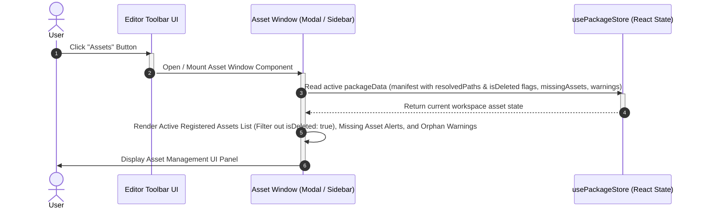
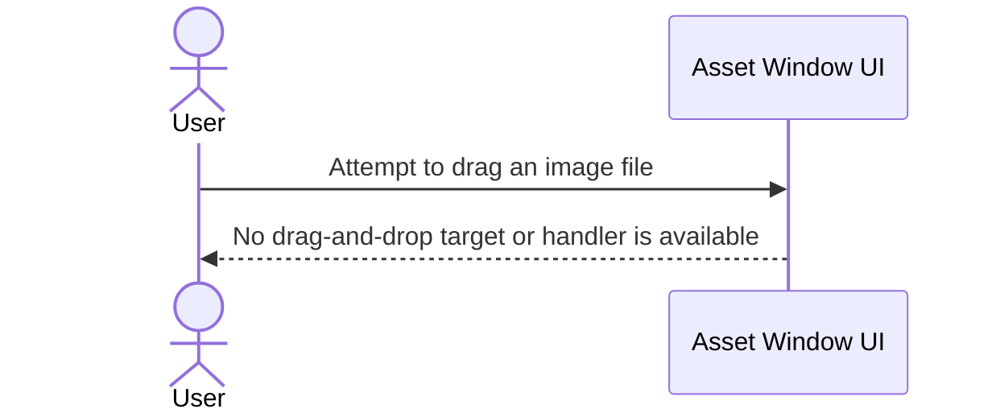
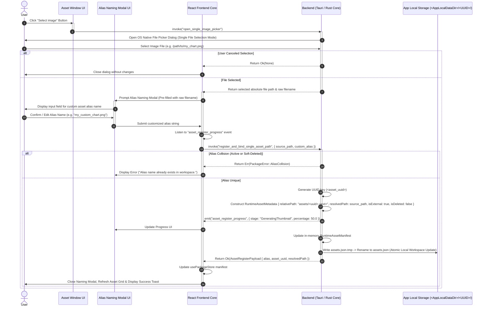
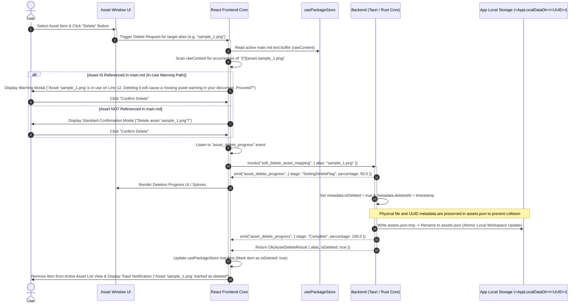
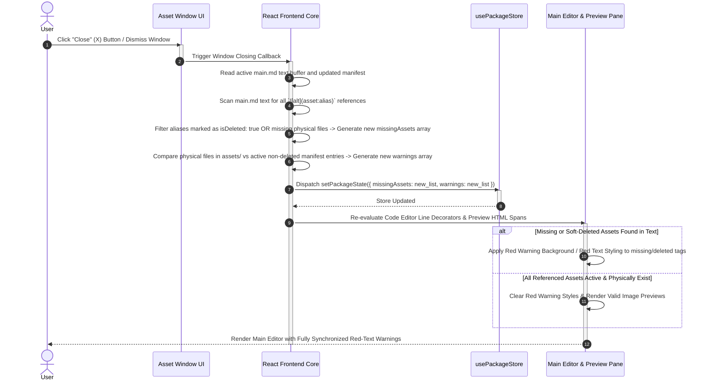

# Asset Management Window Operations, Single-Asset Upload, Soft-Deletion (Delete Flag), Dynamic Path Mapping, and Editor State Synchronization

## 1. Sequence Overview

This sequence defines the complete user-driven asset management lifecycle operating between the Main Editor, the dedicated Asset Window (Sidebar/Modal), and the Rust backend storage engine. It strictly enforces a **Single Asset per Upload Operation Constraint** and a **Soft Delete Strategy (`isDeleted: true` flag)** to avoid UUID/alias collisions and prevent storage corruption. It is partitioned into 5 modular sub-sequences:

1. **`SEQ-MD-03-A` (Open Asset Window):** Invoked via Toolbar button to inspect registered assets, physical missing file warnings, deleted asset flags, and unregistered orphan files.
2. **`SEQ-MD-03-C` (Add Single Asset via File Picker + Custom Alias Naming):** Invoking the themed OS native file picker control (single selection), prompting the Alias Naming Modal, registering the absolute path into the active manifest, and updating runtime mappings. Drag-and-drop is intentionally unavailable.
4. **`SEQ-MD-03-D` (Soft Delete Asset with Real-time `main.md` Reference Inspection & Delete Flag):** Scanning active `main.md` text prior to deletion, displaying line warnings if referenced, and marking the asset entry as `isDeleted: true` in `assets.json` without removing metadata or UUIDs.
5. **`SEQ-MD-03-E` (Close Asset Window & Sync State to Editor):** Recalculating active `missingAssets` (including `isDeleted` entries) and `warnings` arrays upon closing/mutating, committing updated state to React for live editor red-text decoration updates.

---

## 2. Sequence Diagrams

### 2.1 `SEQ-MD-03-A`: Open Asset Window



---

### 2.2 `SEQ-MD-03-B`: Drag-and-Drop Is Unavailable



---

### 2.3 `SEQ-MD-03-C`: Add Single Asset via File Picker with Custom Alias Naming



---

### 2.4 `SEQ-MD-03-D`: Soft Delete Asset with Real-time `main.md` Reference Inspection & Delete Flag



---

### 2.5 `SEQ-MD-03-E`: Close Asset Window & Sync State to Editor



---

## 3. Data Contracts & State Specifications

### 3.1 Runtime Asset Metadata Specification (Soft Delete Enabled)

```typescript
export interface RuntimeAssetMetadata {
  uuid: string;             // Immutable Asset UUID
  relativePath: string;     // Portable package-relative path for saving (e.g. "assets/3f8b9a20.png")
  resolvedPath: string;     // Active absolute path on OS or asset-stream:// URI
  mimeType: string;         // MIME string
  size: number;             // Byte size
  isExternal: boolean;      // True if referencing external OS file directly
  isDeleted: boolean;       // Soft delete flag (true = marked for deletion on next save)
  deletedAt?: number;       // Unix epoch timestamp when soft delete was requested
}

```

### 3.2 Progress Event Payloads (`asset_register_progress` / `asset_delete_progress`)

```typescript
export interface AssetRegisterProgressPayload {
  stage: 'ValidatingAlias' | 'GeneratingThumbnail' | 'Complete';
  percentage: number;      // Progress percentage (0.0 to 100.0)
}

export interface AssetDeleteProgressPayload {
  stage: 'SettingDeleteFlag' | 'Complete';
  percentage: number;      // Progress percentage (0.0 to 100.0)
}

```

---

## 4. Operational Guard & State Transition Rules

1. **Single Asset Upload Guard (`SEQ-MD-03-C`):**
The Asset Window provides only the OS file picker in single-selection mode. It does not render a drag-and-drop target or register drop handlers.
2. **Metadata Retention & Soft Delete Strategy (`SEQ-MD-03-D`):**
Executing a delete action sets `isDeleted: true` on the target asset entry within `assets.json` and memory stores. The entry, UUID, and alias key remain intact to prevent alias/UUID collisions during the session. Physical unlinking or exclusion from final ZIP packages occurs exclusively during **`SEQ-MD-04` (Save Action)**.
3. **Editor Missing Asset Red-Text Flagging (`SEQ-MD-03-E`):**
Any image tag in `main.md` referencing an asset marked with `isDeleted: true` is automatically flagged in `missingAssets`, immediately triggering red warning line decorators in the Code Editor and warning spans in Preview.