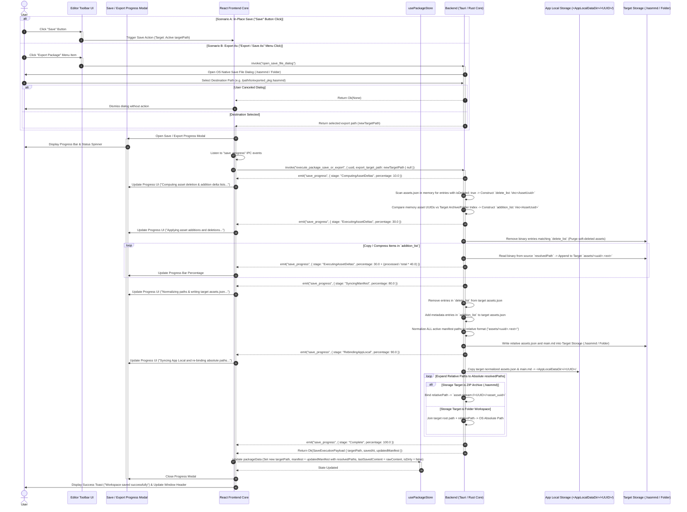

# Workspace Save, Export, Asset Delta Packing, Path Normalization, and Archive Writing

## 1. Sequence Overview

This sequence defines the execution lifecycle for persisting the active workspace. It unifies **In-Place Save (Overwrite)** and **Package Export (Save As / Convert)** into a single consolidated sequence. To maximize performance and prevent full archive re-compression overheads, it executes a **Delta Asset Synchronization Algorithm** based on five strict operational steps:

1. **Deletion List Generation:** Scanning `assets.json` for entries marked with `isDeleted: true`.
2. **Addition List Generation:** Comparing in-memory UUIDs against the target archive/folder index to collect newly added external assets.
3. **Delta Execution:** Unlinking deletion list binaries and appending addition list binaries into the target storage.
4. **Archive Manifest Synchronization & Path Normalization:** Stripping soft-deleted entries, committing new asset records, and converting all `resolvedPath` references to portable package-relative paths (`assets/<uuid_filename>`).
5. **App Local Sync & Absolute Path Re-binding:** Flushing the normalized manifest back to `App Local` and re-expanding relative paths to absolute `resolvedPath` URIs in memory.

---

## 2. Sequence Diagram



---

## 3. Data Contracts & State Specifications

### 3.1 IPC Invocation Payload (`execute_package_save_or_export`)

```typescript
export interface ExecuteSaveOrExportArgs {
  uuid: string;                   // Active workspace UUID
  exportTargetPath: string | null;// Null for In-Place Overwrite; Absolute path string for Export As
  formatType?: 'Archive' | 'Folder'; // Optional target format override during export
}

export interface SaveExecutionPayload {
  targetPath: string;             // Final target path on disk where package was committed
  savedAt: number;                // Epoch timestamp of completed save
  updatedManifest: RuntimeAssetManifest; // Re-bound manifest with active resolvedPath entries
}

```

### 3.2 Delta Operation Context (Internal Rust Engine)

```rust
pub struct AssetDeltaContext {
    pub delete_list: Vec<String>,       // List of Asset UUIDs / Aliases marked with isDeleted: true
    pub addition_list: Vec<String>,     // List of Asset UUIDs present in memory but missing from Target
    pub unmodified_list: Vec<String>,   // List of existing valid Asset UUIDs requiring zero I/O
}

```

---

## 4. Operational Guard & Delta Sync Rules

1. **Strict Delta Execution Bounding:**
Unmodified assets (`unmodified_list`) are never extracted, copied, or re-compressed during save. Only entries in `delete_list` and `addition_list` trigger file I/O operations, ensuring saving remains near-instantaneous even for multi-gigabyte packages.
2. **Complete Soft-Delete Purge:**
Items in `delete_list` are permanently deleted from the target archive/folder binary storage and stripped from the target `assets.json` during Phase 4 & 5. Once save completes, soft-deleted entries are purged from React `usePackageStore`.
3. **App Local Sync & Re-binding Guarantee:**
Immediately following target write completion, the normalized `assets.json` is flushed to `App Local`, and all relative paths are dynamically re-expanded into `resolvedPath` absolute URIs. This guarantees that the live editor preview remains fully responsive and unbroken after a save operation.