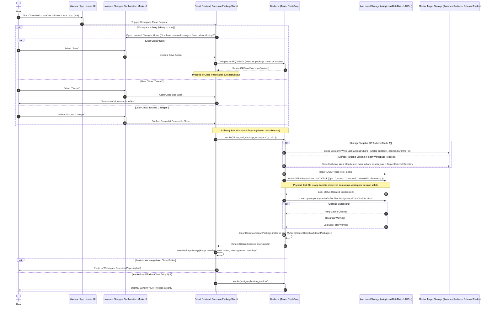

# Workspace Close, Process Lock Release, and App Local Cleanup Lifecycle

## 1. Sequence Overview

This sequence handles the operational lifecycle for closing an active workspace—whether triggered by navigating back to the selection screen (`/select`), closing the specific workspace window, or quitting the application. It guarantees data protection, universal OS file handle safety across all storage targets (`Mode A` Archive and `Mode B` Folder), process lock unbinding, and local disk hygiene:

1. **Unsaved Changes Interception (`isDirty` Check):** Prompting a dirty-state confirmation modal if unsaved changes exist, allowing the user to Save (delegating to `SEQ-MD-04`), Discard Changes, or Cancel Close.
2. **Universal OS File Handle Release (Target-Specific):** Explicitly closing OS file handles applied directly to the master storage target:
* **Mode A (ZIP Target `.hasmmd`):** Releasing exclusive write lock and read/share handles held directly on the `.hasmmd` archive file.
* **Mode B (Folder Target):** Releasing exclusive write file handles held on `main.md` and `assets.json` within the target external directory.


3. **Single-Workspace Process Lock Release (PID Unlock Update):** Retaining the physical `.lock` file within `App Local` to prevent race conditions while atomically updating its internal status payload from an active PID to an unassigned/unlocked state (`PID: 0` / `status: "Unlocked"`).
4. **App Local Sandbox Garbage Collection:** Selectively cleaning up temporary workspace buffers and cache files in `<AppLocalDataDir>/<UUID>/` without corrupting retained workspace state.
5. **State Reset & Route Transition:** Resetting `usePackageStore` to its null state and routing to `/select` or terminating the application window cleanly.

Closing cleans App Local temporary state and releases handles; it does not remove images already materialized in the saved folder or archive target.

---

## 2. Sequence Diagram



---

## 3. Data Contracts & State Specifications

### 3.1 Lock File Payload Format (`<AppLocalDataDir>/<UUID>/.lock`)

```json
{
  "pid": 0,
  "status": "Unlocked",
  "workspaceUuid": "3f8b9a20-1c2d-4e5f-a678-9b0c1d2e3f4a",
  "lastReleasedAt": 1786533440000
}

```

### 3.2 IPC Invocation & Payload Specification (`close_and_cleanup_workspace`)

```typescript
export interface CloseWorkspaceArgs {
  uuid: string;             // Active workspace UUID to unmount
  forceDiscard?: boolean;   // True if explicit "Discard Changes" was confirmed
}

export interface WorkspaceClosePayload {
  uuid: string;             // Closed workspace UUID
  lockReleased: boolean;    // True if .lock payload was set to PID: 0 / Unlocked
  masterHandlesClosed: boolean; // True if master archive / target folder locks were released
  closedAt: number;         // Epoch timestamp of completed close action
}

```

---

## 4. Operational Guard & Lock Release Rules

1. **Target-Specific Lock Release:**
* **Mode A (ZIP):** Reverses the lock acquired during launch by releasing all file handles (read-stream and write-lock) bound to the `.hasmmd` archive file on disk.
* **Mode B (Folder):** Reverses the locks acquired on `main.md` and `assets.json` within the external workspace directory.


2. **App Local Lock Retention and Atomic Status Transition:**
The `.lock` file residing inside `<AppLocalDataDir>/<UUID>/` is updated atomically to `pid: 0` and `status: "Unlocked"`. It is kept on disk as a session reference.
3. **Safe Multi-Instance Re-mounting:**
Any new application window attempting to open the workspace in `SEQ-MD-01` verifies that the target archive / folder is free of active OS handles and that `.lock` exhibits an `Unlocked` status before binding new locks.