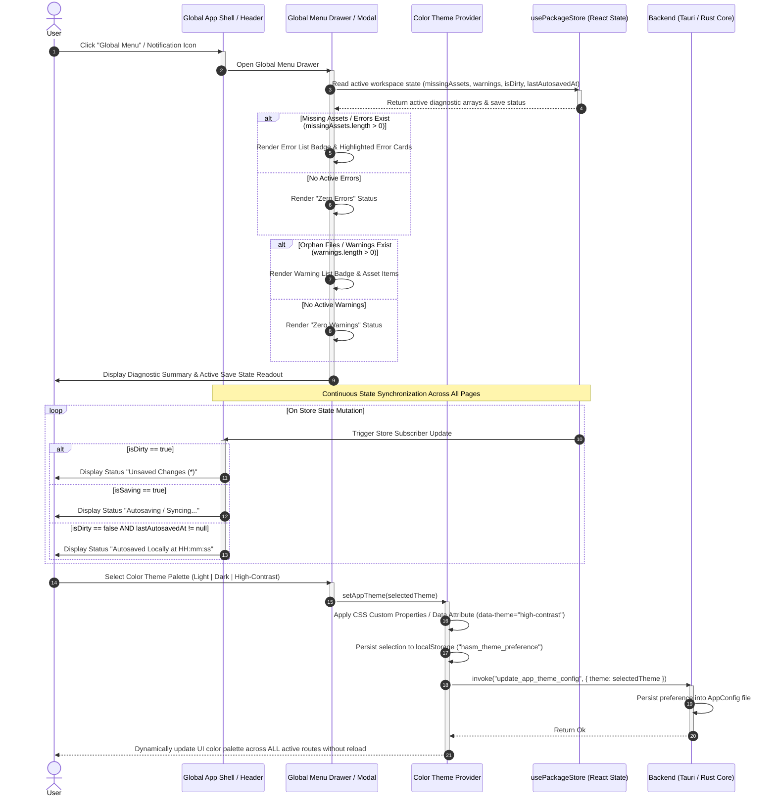

# SEQ-MD-06_Others: Global Menu Notifications, Save State Indicator, and Dynamic Color Theme Switching

## 1. Sequence Overview

This sequence defines the global cross-cutting UI services available across all application routes (`/select`, `/editor`, `/loading-model`, `/error-model`, `/error-app`). It establishes:

1. **Global Navigation & Diagnostic Menu:** A persistent drawer/modal providing instant access to workspace diagnostic lists:
* **Warning List:** Displays unregistered orphan files and soft-deleted asset references.
* **Error List:** Displays `missingAssets` tags (referenced in `main.md` but missing physically) and process lock warnings.


2. **Real-time Save State Readout:** A synchronized UI indicator displaying the live status (`Dirty / Unsaved (*)` vs `Autosaved Locally at HH:mm:ss` vs `Master Target Synced`).
3. **App-wide 3-Color Theme Selector:** Real-time theme switching across 3 standardized color palettes (**`Light`**, **`Dark`**, and **`High-Contrast`**), persisting user selection into `AppConfig` memory and `localStorage`.

---

## 2. Sequence Diagram



---

## 3. Data Contracts & State Specifications

### 3.1 Theme Palette Enumeration & Configuration

```typescript
export type AppThemeMode = 'Light' | 'Dark' | 'High-Contrast';

export interface AppThemeConfig {
  themeMode: AppThemeMode;
  accentColor: string;
  warningColor: string; // Red-text warning color override (#ef4444 for Light/Dark, #ff0000 for High-Contrast)
}

```

### 3.2 Global Diagnostic Summary Contract

```typescript
export interface DiagnosticSummary {
  errorCount: number;         // Count of missingAssets items
  errorList: MissingAssetInfo[];
  warningCount: number;       // Count of unregistered orphan items
  warningList: PackageWarning[];
  saveState: 'Dirty' | 'Saving' | 'Autosaved' | 'Synced';
  lastSavedFormatted: string; // "HH:mm:ss" string
}

```

---

## 4. Operational Guard & Theme Persistence Rules

1. **Cross-Route Persistent Diagnostics:**
The Global Menu notification badges (Error List / Warning List) are rendered inside the root application shell (`AppLayout`), making diagnostic details accessible regardless of whether the user is on `/select`, `/editor`, or an error screen.
2. **Instant Theme Switching SLA:**
Changing color sets toggles standard CSS variables at the root `<html>` element (`data-theme`), completing full UI re-skinning within **16ms (1 frame)** without requiring application restart or page refresh.
3. **High-Contrast Warning Guarantee:**
When `High-Contrast` theme is selected, error tags, missing asset line decorators, and red-text warning spans are rendered using pure high-visibility red (`#ff0000` / `#ffffff` background) to ensure accessibility compliance.

---