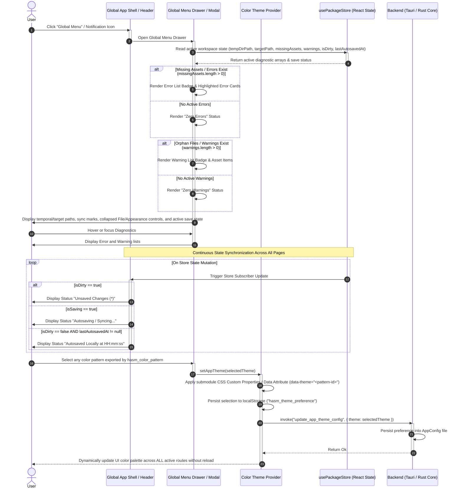

# SEQ-MD-06_Others: Global Menu Notifications, Save State Indicator, and Dynamic Color Theme Switching

## 1. Sequence Overview

This sequence defines the global cross-cutting UI services available across all application routes (`/select`, `/editor`, `/loading-model`, `/error-model`, `/error-app`). It establishes:

1. **Global Navigation & Diagnostic Menu:** A persistent drawer/modal providing instant access to workspace diagnostic lists:
* **Warning List:** Displays unregistered orphan files and soft-deleted asset references.
* **Error List:** Displays `missingAssets` tags (referenced in `main.md` but missing physically) and process lock warnings.
* **Header Diagnostics:** The Diagnostics control beside the hamburger menu opens the error and warning list on hover or keyboard focus.


2. **Real-time Save State Readout:** A synchronized UI indicator displaying the live status (`Dirty / Unsaved (*)` vs `Autosaved Locally at HH:mm:ss` vs `Master Target Synced`). Hovering or keyboard-focusing this indicator exposes the active local-folder or archive `targetPath`. The drawer summary shows both `tempDirPath` and `targetPath`, each with a Current/Synced, Pending, or Unavailable state mark; a clean `Ready` workspace marks both as current.
3. **App-wide Color Pattern Selector:** Real-time theme switching across every pattern exported by the shared `src/hasm_color_pattern` submodule. The standard compatibility patterns are **`Light`** (`sand`), **`Dark`** (`classic`), and **`High-Contrast`** (`high-contrast`); all other exported patterns are available through local preference persistence.
4. **Collapsed Drawer Controls:** File and Appearance sections are collapsed when the hamburger drawer opens and expand independently when selected.

---

## 2. Sequence Diagram



---

## 3. Data Contracts & State Specifications

### 3.1 Theme Palette Enumeration & Configuration

```typescript
export type AppThemeMode = 'Light' | 'Dark' | 'High-Contrast';

export interface AppThemeConfig {
  themeMode: AppThemeMode;
  accentColor: string;
  warningColor: string; // Red-text warning color override (#ef4444 for Light/Dark, #ff0000 for High-Contrast)
}

```

### 3.2 Global Diagnostic Summary Contract

```typescript
export interface DiagnosticSummary {
  errorCount: number;         // Count of missingAssets items
  errorList: MissingAssetInfo[];
  warningCount: number;       // Count of unregistered orphan items
  warningList: PackageWarning[];
  saveState: 'Dirty' | 'Saving' | 'Autosaved' | 'Synced';
  lastSavedFormatted: string; // "HH:mm:ss" string
}

```

---

## 4. Operational Guard & Theme Persistence Rules

1. **Cross-Route Persistent Diagnostics:**
The Global Menu notification badges (Error List / Warning List) are rendered inside the root application shell (`AppLayout`), making diagnostic details accessible through the hover/focus Diagnostics control regardless of whether the user is on `/select`, `/editor`, or an error screen.
2. **Instant Theme Switching SLA:**
Changing color sets toggles standard CSS variables at the root `<html>` element (`data-theme`), completing full UI re-skinning within **16ms (1 frame)** without requiring application restart or page refresh.
3. **High-Contrast Warning Guarantee:**
When the `high-contrast` pattern is selected, error tags, missing asset line decorators, and red-text warning spans are rendered using pure high-visibility red (`#ff0000` / `#ffffff` background) to ensure accessibility compliance.

## 5. Implemented Ownership

The current implementation keeps the global shell in `src/main.jsx` and `src/Menu.jsx` rather than introducing a separate router/store layer. `Menu` is rendered before both the boot screen and editor content, so diagnostics, theme selection, and status remain available during boot. Its drawer summary reads the normalized `tempDirPath` and `targetPath`, then derives local/master Current/Synced, Pending, or Unavailable marks from the workspace and save state. File and Appearance controls remain collapsed until selected; Diagnostics opens on hover or focus. `main.jsx` imports `COLOR_PATTERN_OPTIONS`, validates selections with `isValidColorPattern`, resolves each selection through `getPatternById`, and applies the exported variables to the root shell. It maps the legacy backend modes `Light`, `Dark`, and `High-Contrast` to `sand`, `classic`, and `high-contrast`; other patterns persist locally. It also owns cross-route state aggregation, boot restoration, editor line selection, and save-state transitions. The Rust command facade in `src-tauri/src/commands/mod.rs` writes and reads `AppConfig.json` atomically under the Tauri application config directory for the standard compatibility modes.

Validation is covered by `npm run check:react-render`, `npm run check:tauri-build`, and `npm run check:seq-md-06`.

---